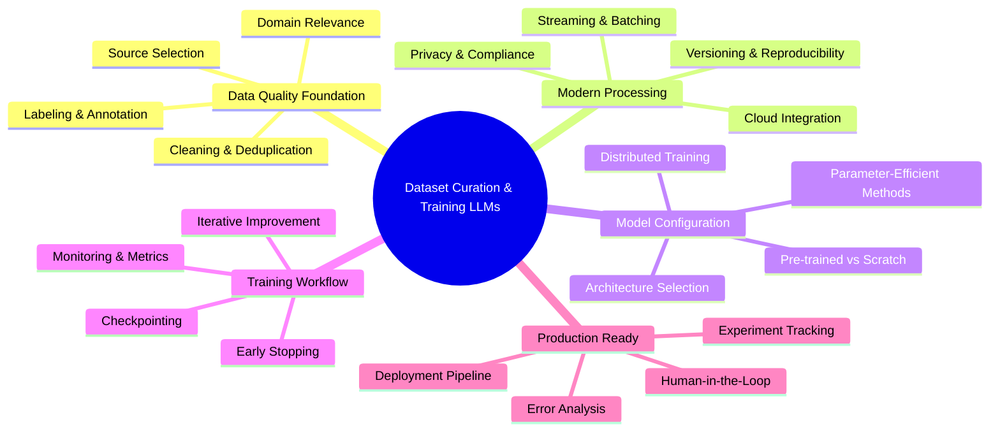
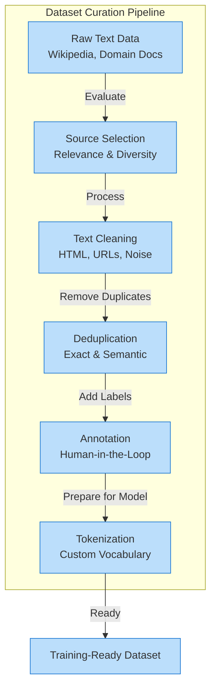
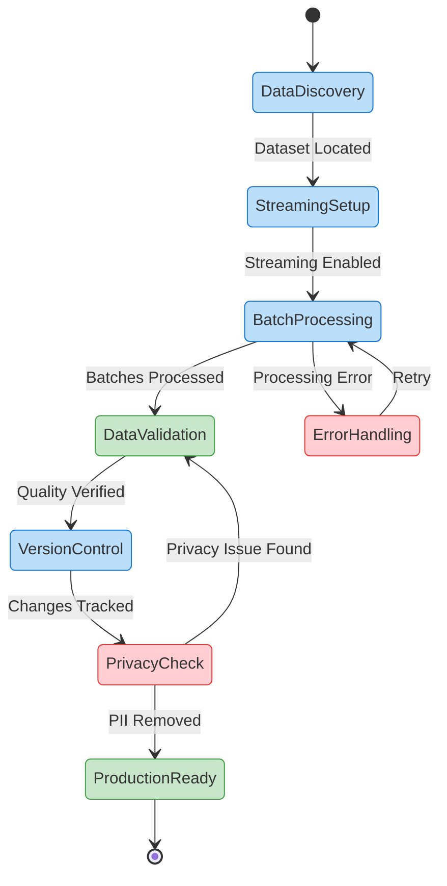
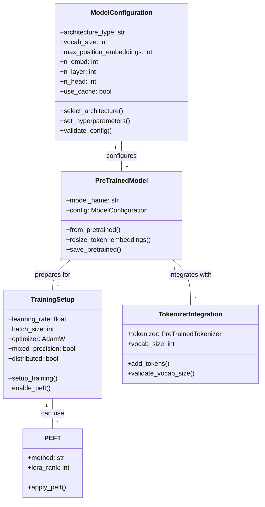

# Building Custom Language Models: From Raw Data to AI Solutions

In today's AI-driven world, the ability to create custom language models tailored to specific domains and tasks represents a critical competitive advantage. This comprehensive guide walks you through the complete lifecycle of building language models from the ground up—from curating high-quality datasets to training and refining powerful AI systems.

Whether you're developing specialized models for healthcare, finance, legal services, or any domain requiring nuanced understanding, this chapter provides the practical knowledge and code examples you need to succeed. We'll explore modern techniques using the Hugging Face ecosystem that balance efficiency, scalability, and model quality.

In this chapter, we'll cover:

- Data curation fundamentals: selecting, cleaning, and preparing domain-specific text
- Scalable processing techniques for handling massive datasets efficiently
- Privacy protection and data versioning for responsible AI development
- Modern model architecture selection and configuration strategies
- Training workflows with distributed computing and experiment tracking
- Parameter-efficient fine-tuning methods for adapting large models
- Evaluation, error analysis, and iterative improvement techniques

By the end of this chapter, you'll have both the theoretical understanding and practical skills to transform raw text into powerful, domain-specific language models that deliver real business value. Let's begin your journey toward AI mastery.

# Dataset Curation and Training Language Models from Scratch - Article 11



**Step-by-Step Explanation:**

- Root node centers on **Dataset Curation & Training LLMs**
- Branch covers **Data Quality Foundation** with cleaning and labeling essentials
- Branch details **Modern Processing** including streaming and compliance
- Branch explains **Model Configuration** from architecture to distributed setups
- Branch shows **Training Workflow** with monitoring and iteration
- Branch highlights **Production Ready** features for real-world deployment

## Introduction: From Raw Data to Custom Language Models

To build a great language model, you need great data. Picture your dataset as ingredients for a gourmet meal—the fresher and more carefully chosen, the better the final dish. Even the most sophisticated AI architecture can't salvage a flawed foundation. **Ready to transform raw text into powerful AI?**

This chapter explores why curating high-quality datasets remains the first—and most critical—step in building effective language models. In today's AI landscape, most practitioners start with a strong pre-trained model (available on the Hugging Face Model Hub) and fine-tune it on their domain-specific data. This approach proves efficient, cost-effective, and enables rapid adaptation to unique business, user, or privacy requirements. Training a model entirely from scratch typically serves organizations with massive datasets and compute resources, or highly specialized applications demanding complete control.

Let's break down the key ideas, step by step.

### Setting Up Your Environment

```bash
# Using pyenv (recommended for Python version management)
pyenv install 3.12.9
pyenv local 3.12.9

# Verify Python version
python --version  # Should show Python 3.12.9

# Install with poetry (recommended)
poetry new dataset-curation-project
cd dataset-curation-project
poetry env use 3.12.9
poetry add datasets transformers tokenizers torch accelerate

# Or use mini-conda
conda create -n dataset-curation python=3.12.9
conda activate dataset-curation
pip install datasets transformers tokenizers torch accelerate

# Or use pip with pyenv
pyenv install 3.12.9
pyenv local 3.12.9
pip install datasets transformers tokenizers torch accelerate

```

### Why Data Quality Matters

"Garbage in, garbage out" remains a core truth in AI. If your dataset contains messy, biased, or irrelevant content, your model will reflect those flaws with painful accuracy. Picture a financial company using a generic model that misses industry-specific terms or context. By curating a dataset of financial documents, you enable your model to actually understand your domain—transforming it from a general assistant into a specialist.

### The Value of Fine-Tuning and Custom Training

Pre-trained models like GPT-3, BERT, or Llama 3 trained on vast, general data. But sometimes, you need a model that speaks your language—literally. Fine-tuning empowers you to:

- Include rare or industry-specific vocabulary seamlessly
- Filter out sensitive or irrelevant content precisely
- Meet strict privacy or compliance requirements confidently
- Rapidly adapt to new domains with limited resources

Training from scratch still matters for certain scenarios: when you require a fully custom architecture, need control over every aspect of the model, or must guarantee data residency and privacy.

**Example:** A healthcare provider can fine-tune a pre-trained model on anonymized clinical notes using Hugging Face's Trainer API, ensuring it understands medical jargon while respecting patient privacy completely.

### What Modern Data Curation Involves

Curation transcends merely collecting files. It demands:

- Selecting relevant, diverse sources strategically
- Cleaning and standardizing text meticulously
- Removing duplicates and noise (including semantic deduplication)
- Annotating and labeling (with tools like Argilla for human-in-the-loop workflows)
- Tokenizing (splitting text into model-friendly pieces) and building vocabulary that fits your domain
- Versioning and tracking your data for reproducibility

Modern workflows often leverage the Hugging Face Datasets library for scalable, memory-efficient data loading and transformation. For large-scale or streaming data, Datasets supports processing data on-the-fly, making it possible to curate web-scale corpora without exhausting memory.

Increasingly, LLMs themselves handle advanced data cleaning, deduplication, and even initial annotation—automating the removal of outliers, semantic duplicates, and low-quality samples. Synthetic data generation with LLMs or diffusion models also provides a common strategy to augment datasets and improve model robustness, especially in low-resource or highly specialized domains.

Let's examine a simple example. Suppose your customer service logs contain HTML tags, inconsistent spacing, and duplicates. Here's a basic cleaning function in Python using the Hugging Face Datasets library:

### Basic Data Cleaning with Hugging Face Datasets

```python
import re
from datasets import load_dataset

dataset = load_dataset("csv", data_files="customer_logs.csv")

def clean_text(example):
    # Remove HTML tags
    text = re.sub(r'<.*?>', '', example["text"])
    # Replace multiple spaces/newlines with a single space
    text = re.sub(r'\\s+', ' ', text)
    # Strip leading/trailing whitespace
    text = text.strip()
    return {"text": text}

cleaned_dataset = dataset.map(clean_text)

print(cleaned_dataset["train"][0]["text"])  # Output: Cleaned text sample

```

**How this works:**

1. Loads your dataset using Hugging Face Datasets (supports CSV, JSON, Parquet, and streaming)
2. Removes HTML tags like `<p>` completely
3. Replaces extra spaces or newlines with a single space
4. Trims spaces from the start and end

This represents a starting point. In production, you may employ LLM-assisted cleaning for more complex tasks—such as detecting semantic duplicates, flagging outliers, or even auto-labeling data.

### Why Invest in Modern Data Curation?

High-quality data becomes your competitive edge. Custom-curated and well-annotated datasets allow your models to:

- Outperform generic models in specialized tasks dramatically
- Reduce errors in critical business processes significantly
- Ensure privacy and regulatory compliance completely
- Enable support for rare languages or unique domains effectively
- Adapt quickly to new requirements using fine-tuning or continual learning

Tools like Hugging Face Datasets and Argilla (for collaborative annotation and versioning) now represent standards for scalable, reproducible, and team-based data workflows.

Mastering data curation—and knowing when to fine-tune versus train from scratch—lets you build models that fit your needs, not just what's available off the shelf. **Ever wondered what unique data could give your model an unstoppable edge?**

### What's Next?

Next, we'll dive into practical steps for preparing and curating high-quality datasets: selecting sources, cleaning (with both code and LLM-based methods), labeling with modern annotation tools, and building custom tokenizers. We'll also explore streaming and versioning strategies for large-scale data, and introduce synthetic data augmentation.

For more on tokenization, see Article 5. For privacy, advanced curation, and human-in-the-loop annotation, see Articles 11 and 12.

## Preparing and Curating High-Quality Datasets

Great language models start with great data. Picture your dataset as soil—rich and well-tended data grows robust AI. In this section, you'll master the essentials: how to select, clean, label, and tokenize text using up-to-date tools and best practices, so your model learns from the best possible foundation.

Regardless of your use case—legal analysis, customer support, or scientific summarization—the quality, diversity, and freshness of your dataset directly shape your results. We'll break down each step of the modern data curation process.



**Step-by-Step Explanation:**

- `Raw Text Data` includes sources like Wikipedia and domain documents
- `Source Selection` evaluates relevance and diversity
- `Text Cleaning` removes HTML, URLs, and noise
- `Deduplication` eliminates exact and semantic duplicates
- `Annotation` adds labels with human-in-the-loop processes
- `Tokenization` creates custom vocabulary for your domain
- Final output is a `Training-Ready Dataset`

### Selecting and Cleaning Raw Text Data

Start by choosing data that matches your application. For general models, Common Crawl and Wikipedia remain foundational—ensure you use recent snapshots to avoid model staleness. For specialized tasks, seek out up-to-date, domain-specific corpora (e.g., legal documents, medical texts, business logs).

### Data Quality Checklist

| Criterion | Key Questions | Why It Matters |
| --- | --- | --- |
| **Relevance** | Does the text match your target use case? | Ensures model learns domain-specific patterns |
| **Diversity** | Is there a mix of topics, styles, and authors? | Prevents bias and improves generalization |
| **Quality** | Is the text well-formed and free of noise? | Reduces training on corrupted examples |
| **Freshness** | Are you using the latest available data? | Prevents model drift and outdated knowledge |

Modern NLP cleaning surpasses simple regex. Expect to encounter boilerplate (headers/footers), duplicates, HTML tags, URLs, emojis, code snippets, and potentially sensitive or offensive content. Leverage scalable tools to handle these challenges across large datasets.

### Scalable Text Cleaning and Deduplication with Hugging Face Datasets

```python
import datasets
import unicodedata
import re

# Load a recent English Wikipedia snapshot
wiki = datasets.load_dataset("wikipedia", "20220301.en", split="train")

# Unicode normalization and basic cleaning
def clean_text(example):
    text = unicodedata.normalize('NFKC', example['text'])  # Unicode normalization
    text = re.sub(r'<.*?>', '', text)  # Remove HTML tags
    text = re.sub(r'https?://\\S+', '', text)  # Remove URLs
    text = re.sub(r'\\s+', ' ', text)  # Normalize whitespace
    text = text.strip()
    return {"text": text}

# Apply cleaning
wiki = wiki.map(clean_text, num_proc=4)

# Remove duplicates
wiki = wiki.unique("text")

```

This example uses Hugging Face Datasets for efficient, parallel cleaning and deduplication. It applies Unicode normalization, removes HTML tags, URLs, and normalizes whitespace. For large-scale projects, always use `.map()` and `.unique()` for performance and reproducibility.

### Automated Language Detection and Filtering

```python
from langdetect import detect

def filter_english(example):
    try:
        return detect(example['text']) == 'en'
    except:
        return False

# Filter for English language only
wiki = wiki.filter(filter_english, num_proc=4)

```

Language detection (e.g., with `langdetect` or `fasttext`) ensures your dataset matches your target language. For multilingual projects, use automated filtering to maintain consistency.

For privacy and compliance, it's now standard to remove or mask personally identifiable information (PII) using Named Entity Recognition (NER) or regular expressions. Libraries like spaCy or Presidio help automate this process.

**Tip:** Always check random samples after cleaning and filtering. This helps verify that your pipeline hasn't removed too much—or left in unwanted content.

For versioning and reproducibility, consider using DVC (Data Version Control) or Hugging Face Datasets' built-in versioning features to track changes in your dataset over time.

**Key takeaway:** Modern, scalable cleaning pipelines—paired with versioning—prove essential for robust model training.

### Human-in-the-Loop Data Labeling

For many tasks, clean data isn't enough—you need high-quality labels. While some models (like large language models) can learn from raw text, most business applications require supervised, labeled examples—such as sentiment, intent, or domain-specific categories.

Automated labeling runs fast, but people catch subtleties that machines miss: sarcasm, legal nuance, or rare edge cases. Human-in-the-loop annotation ensures your dataset reflects real-world needs and reduces hidden biases.

**Example:** Building a support chatbot to flag 'urgent' messages. Automated rules might miss context, but human annotators spot urgency even when it's subtle. Modern tools like Argilla (see Article 12) support collaborative labeling, track annotator disagreements, and provide audit trails for reproducibility.

Best practices for human annotation:

- Write clear, detailed instructions and provide examples for annotators
- Use multiple annotators per example to catch mistakes and reduce bias
- Regularly review disagreements, update guidelines, and retrain annotators as needed
- Ensure privacy: Mask or remove PII before annotation, especially in sensitive domains

Synthetic data augmentation—generating labeled examples using LLMs or data generation tools—can supplement human-annotated data, especially for rare classes or low-resource domains. See Article 8 for practical augmentation workflows.

Investing in quality labels pays off—especially in high-stakes or nuanced domains. For advanced annotation workflows and continuous feedback loops, see Article 12.

### Tokenization and Vocabulary Creation

Clean, labeled data stands almost ready—but models can't use raw text. They need tokens: units like words, subwords, or characters. Tokenization bridges the gap, and modern workflows rely on integrated Hugging Face APIs for both standard and custom tokenizers.

Picture tokenization as slicing bread. How you cut (tokenize) determines how well the filling (meaning) fits. For general English, pre-trained tokenizers (e.g., BERT, GPT-2) work well. For specialized or multilingual data, training a custom tokenizer—often with SentencePiece Unigram or BPE—can boost performance dramatically.

Popular tokenization algorithms:

- **SentencePiece Unigram:** Flexible and robust for multilingual and domain-specific tasks. Widely used in T5 and recent LLMs
- **Byte-Pair Encoding (BPE):** Splits rare words into subwords, balancing vocabulary size and coverage
- **WordPiece:** Used in BERT; similar to BPE but merges differently

For most workflows, use Hugging Face's `AutoTokenizer` and the `transformers` library for seamless integration with models and pipelines. If you need to train a custom tokenizer, leverage the `tokenizers` or `sentencepiece` integration.

### Training a Custom Tokenizer with Hugging Face Transformers (SentencePiece)

```python
from transformers import AutoTokenizer, PreTrainedTokenizerFast
from tokenizers import trainers, Tokenizer, models, pre_tokenizers, processors

# Example: Train a Unigram tokenizer using SentencePiece
from tokenizers import Tokenizer, models, pre_tokenizers, trainers

# Load your cleaned text file(s)
files = ["./data/cleaned_corpus.txt"]

# Initialize a Unigram model
tokenizer = Tokenizer(models.Unigram())
tokenizer.pre_tokenizer = pre_tokenizers.Whitespace()
trainer = trainers.UnigramTrainer(vocab_size=30000, special_tokens=["<pad>", "<unk>", "<s>", "</s>"])
tokenizer.train(files, trainer)

tokenizer.save("./tokenizer-unigram.json")

# Load into Hugging Face for use with models
hf_tokenizer = PreTrainedTokenizerFast(tokenizer_file="./tokenizer-unigram.json")

```

This code trains a Unigram tokenizer (SentencePiece-style) on your cleaned data, builds a vocabulary of 30,000 tokens, and saves it for use with Hugging Face models. For most use cases, prefer SentencePiece/Unigram for new projects unless you have a specific architecture requirement.

### Using Your Trained Tokenizer with Hugging Face Transformers

```python
from transformers import PreTrainedTokenizerFast

# Load the trained tokenizer
hf_tokenizer = PreTrainedTokenizerFast(tokenizer_file="./tokenizer-unigram.json")

# Tokenize a domain-specific sentence
print(hf_tokenizer.tokenize("myocardial infarction"))
# Output: ['myocardial', 'infarction']  # Example output

```

Test your tokenizer on real, domain-specific sentences to ensure important terms aren't split awkwardly. For example, in medical data, 'myocardial infarction' should not fragment into meaningless subwords.

For large-scale and streaming data, Hugging Face Datasets supports tokenization pipelines using `.map()` and can process data on-the-fly, making it easy to scale up efficiently.

**Key takeaway:** A well-designed tokenizer and vocabulary—built with modern Hugging Face APIs—reduces unknown tokens and helps your model understand your domain.

For a deep dive into tokenization strategies and debugging, see Article 5.

### Key Takeaways

- Select data that fits your task, remains as diverse and recent as possible, and matches your language/domain needs
- Clean thoroughly using scalable pipelines to remove noise, bias, and sensitive information
- Use human annotators and modern labeling tools for high-quality, reliable labels
- Tokenize and build a vocabulary tailored to your data and domain using current Hugging Face APIs
- Track dataset versions for reproducibility and auditability

Solid, modern data preparation forms the bedrock of successful model training. For advanced data workflows, augmentation, and annotation strategies, see Articles 8 and 12.

## Scaling Data Processing and Streaming

As your projects grow, so do your datasets—sometimes reaching terabytes or more. Loading all this data at once resembles trying to cook every dish in a restaurant simultaneously: the kitchen will grind to a halt. Instead, you need smart, scalable workflows to keep things running smoothly. In this section, you'll master how to process massive datasets with streaming and batching, track every change for reproducibility, and protect sensitive data throughout your pipeline using the latest tools and best practices.



**Step-by-Step Explanation:**

- System starts at `DataDiscovery` to locate datasets
- Moves to `StreamingSetup` once dataset is found
- `BatchProcessing` handles data in manageable chunks
- `DataValidation` ensures quality standards
- `VersionControl` tracks all changes
- `PrivacyCheck` removes sensitive information
- System reaches `ProductionReady` state when complete
- Error paths allow retry and privacy remediation

### Handling Large-Scale Data with Streaming

When working with huge datasets—think the size of Wikipedia or larger—downloading everything to your machine just isn't practical. This is where streaming and batching come into play. Data streaming lets you process one record at a time, or in manageable batches, keeping only a small portion in memory. Picture it as a conveyor belt: you handle each item as it passes, never piling up a mountain of plates.

The Hugging Face Datasets library makes streaming and batching large datasets straightforward. With streaming enabled, you can iterate over massive datasets efficiently, even on a laptop. You can also stream directly from cloud storage (like S3, GCS, or Azure Blob) by specifying the appropriate dataset path and credentials—a common practice in production environments.

### Listing Available Wikipedia Dataset Versions

```python
from datasets import get_dataset_config_names

# List all available Wikipedia dumps (by date)
print(get_dataset_config_names('wikipedia'))

```

### Streaming and Batch Processing with 🤗 Datasets

```python
from datasets import load_dataset

def process_batch(batch):
    # Example batch processing (e.g., truncating text)
    return {"processed_text": [t[:200] for t in batch["text"]]}

# Always use the latest Wikipedia config (e.g., '20240101.en')
streamed_dataset = load_dataset('wikipedia', '20240101.en', split='train', streaming=True)

# Efficiently process data in batches of 1000
processed = streamed_dataset.map(process_batch, batched=True, batch_size=1000)

# Iterate over the first processed batch
for i, example in enumerate(processed):
    print(example["processed_text"])
    if i >= 2:
        break

```

Let's break it down:

1. `get_dataset_config_names` lets you discover the latest dataset versions, so you're always working with up-to-date data
2. `streaming=True` tells the library to read data one sample at a time, directly from the source—no full download required
3. Batch processing with `batched=True` and `batch_size=1000` lets you efficiently process chunks of data, ideal for tokenization, filtering, or augmentation
4. This streaming approach works for datasets of any size and can read directly from cloud storage, making it ideal for both local and cloud workflows

For even larger-scale or distributed workflows, consider integrating with frameworks like Ray or Spark, or using event streaming platforms (like Kafka or Pulsar) to handle real-time or enterprise-scale data pipelines. Internally, Hugging Face Datasets leverages Apache Arrow for efficient memory management and can interoperate with these distributed systems.

**Key takeaway:** Modern streaming and batching let you process huge datasets efficiently, with minimal memory or storage requirements. For production-scale needs, leverage cloud storage and distributed frameworks for seamless scalability.

### Annotation, Versioning, and Reproducibility

In professional AI projects, you must know exactly what data went into your model and how it was processed. Consider this as keeping a precise recipe—so you (or your team) can always recreate results or explain decisions. This proves especially critical as datasets and teams scale.

Here's how to keep your data process transparent and repeatable:

- **Version control for data:** Use tools like DVC (Data Version Control) to track every change, just like Git tracks code. For cloud-native or petabyte-scale workflows, consider LakeFS or Databricks Delta Lake, which offer data versioning directly on object storage
- **Annotation tracking:** If you label or edit data, log who did what, when, and why, ideally with automated metadata
- **Reproducibility:** Record all preprocessing steps, random seeds, and environment details so anyone can reproduce your results

### Tracking Dataset Versions with DVC

```bash
# Initialize DVC in your project
$ dvc init

# Add your raw dataset to DVC tracking
$ dvc add data/raw_corpus.txt

# Commit the change (with metadata)
$ git add data/raw_corpus.txt.dvc .gitignore
$ git commit -m "Add raw corpus to DVC tracking"

# After cleaning or labeling, add the new version
$ dvc add data/cleaned_corpus.txt
$ git add data/cleaned_corpus.txt.dvc
$ git commit -m "Add cleaned corpus version"

```

What happens here?

1. `dvc init` sets up DVC for your project
2. `dvc add` tracks your dataset, creating a metadata file
3. Use `git` to commit both code and data versions
4. When you update your data, repeat the process. You can always roll back or audit any version

For cloud-native projects, LakeFS and Delta Lake integrate with S3 or Azure Blob, offering Git-like semantics for data versioning at scale.

For full transparency, document every preprocessing step and annotation guideline in a **dataset card**—a structured summary of your data, including its source, cleaning steps, and known limitations. See Article 14 for best practices on dataset cards and responsible data sharing.

**Summary:** Track, document, and version your data and annotations to ensure your work remains reproducible and trustworthy.

### Ensuring Data Privacy and Security

When your data includes personal or confidential information, privacy transcends optional—it's a legal and ethical requirement. Imagine your dataset contains user feedback: what happens if names or emails leak? Protecting sensitive data proves as important as any step in your pipeline, and modern privacy tools make this easier and more robust than ever.

The main strategies:

- **PII detection and removal:** Use automated tools to scan for names, emails, and phone numbers. For production, transformer-based or LLM-powered PII detection (such as with `presidio-analyzer` using transformer models, or OpenAI's GPT-4o via API) can provide higher recall, especially for multilingual or context-dependent data
- **Anonymization:** Replace sensitive details with tokens (like `[EMAIL]` or `[NAME]`) or hash values
- **Differential privacy and synthetic data:** For highly sensitive use cases, consider applying differential privacy (using tools like TensorFlow Privacy or OpenDP) or generating synthetic data to minimize disclosure risk
- **Access controls and encryption:** Store sensitive data in secure, access-controlled locations. Use encryption at rest and in transit, especially in the cloud

### Simple PII Redaction Example (Regex-Based)

```python
import re

def redact_pii(text):
    # Basic email pattern
    text = re.sub(r'[\\w\\.-]+@[\\w\\.-]+', '[EMAIL]', text)
    # Basic phone pattern
    text = re.sub(r'\\b\\d{3}[-.]?\\d{3}[-.]?\\d{4}\\b', '[PHONE]', text)
    # Basic name pattern (not robust)
    text = re.sub(r'Mr\\.\\s+\\w+|Ms\\.\\s+\\w+|Dr\\.\\s+\\w+', '[NAME]', text)
    return text

sample = "Contact Dr. Smith at dr.smith@example.com or 555-123-4567."
print(redact_pii(sample))  # Output: Contact [NAME] at [EMAIL] or [PHONE].

```

This function uses regular expressions to redact emails, phone numbers, and some names. **Note:** these patterns remain basic. For production, use dedicated libraries like `presidio` or `scrubadub`, which now support transformer-based models for more robust and multilingual detection. For the highest accuracy, LLM-based approaches (using models from Hugging Face or OpenAI) can detect nuanced or context-dependent PII.

For advanced privacy needs, consider differential privacy techniques (see TensorFlow Privacy or OpenDP) or synthetic data generation, which can help you share insights without exposing real user data.

Always combine automated redaction with spot checks, especially for high-stakes applications. Stay up to date with data protection laws like GDPR, HIPAA, or CCPA, and consult your compliance team when handling regulated data. For deployment and operational security, see Article 15.

**Summary:** Protect privacy by detecting and redacting sensitive information using the latest tools, securing access, and following all relevant regulations. For advanced use cases, leverage transformer-based PII detection and differential privacy techniques.

## Configuring and Initializing a Model

With your dataset ready, it's time to transform raw data into a working language model. This section walks you through four key steps: selecting the right architecture, setting core hyperparameters, initializing your model, and preparing for scalable, efficient training. All guidance reflects the latest Hugging Face and PyTorch ecosystem best practices.



**Step-by-Step Explanation:**

- `ModelConfiguration` manages architecture selection and hyperparameters
- `PreTrainedModel` loads and configures models from Hugging Face
- `TrainingSetup` handles training configuration including PEFT
- `TokenizerIntegration` ensures vocabulary alignment
- `PEFT` provides parameter-efficient fine-tuning options

### Choosing Model Architecture and Hyperparameters

Start by matching your model architecture to your task:

- **Encoder-only (e.g., BERT):** For understanding tasks like classification or named entity recognition
- **Decoder-only (e.g., GPT):** For generative tasks such as text, code, or story generation
- **Encoder-decoder (e.g., T5, BART):** For sequence-to-sequence tasks like translation or summarization

(See Article 4 for a deeper dive into these architectures.)

Modern workflows overwhelmingly favor **fine-tuning pre-trained models** over training from scratch. Pre-trained weights capture general language knowledge, dramatically reducing compute requirements and improving performance. Only train from scratch if you have unique data, a new language, or conduct foundational research.

### Key Configuration Parameters

| Parameter | Description | Typical Values |
| --- | --- | --- |
| **vocab_size** | Must match tokenizer output | 30K-50K (custom), 50K+ (general) |
| **max_position_embeddings** | Maximum tokens per input | 512-2048 (standard), 4K-8K (long) |
| **n_embd** | Embedding dimension | 768 (base), 1024-2048 (large) |
| **n_layer** | Number of transformer layers | 12 (base), 24-48 (large) |
| **n_head** | Attention heads | 12 (base), 16-32 (large) |
| **use_cache** | Enable KV cache for generation | True (inference), False (training) |

**Tip:** If resources remain limited, start with a smaller model or use parameter-efficient fine-tuning (see below).

### Configuring a GPT-2 Model from Scratch (Modern API)

```python
from transformers import GPT2Config, GPT2LMHeadModel

# Use modern config parameter names
config = GPT2Config(
    vocab_size=30000,                # Match your tokenizer's vocab size
    max_position_embeddings=512,     # Max sequence length (preferred)
    n_embd=768,                      # Embedding size
    n_layer=12,                      # Number of transformer layers
    n_head=12,                       # Number of attention heads
    use_cache=True                   # Enable caching for faster generation
)

model = GPT2LMHeadModel(config)

# Sanity check: vocab size should match embedding matrix
assert config.vocab_size == model.transformer.wte.weight.shape[0], "Vocab size mismatch!"

```

However, the standard and most efficient practice involves starting from a pre-trained model and fine-tuning it for your data. This leverages the extensive knowledge already learned by the model.

### Loading and Adapting a Pre-trained GPT-2 Model

```python
from transformers import GPT2TokenizerFast, GPT2LMHeadModel

tokenizer = GPT2TokenizerFast.from_pretrained("gpt2")
model = GPT2LMHeadModel.from_pretrained("gpt2")

# If you add new tokens, resize embeddings
new_tokens = ["<new_token1>", "<new_token2>"]
num_added = tokenizer.add_tokens(new_tokens)
if num_added > 0:
    model.resize_token_embeddings(len(tokenizer))

# Model and tokenizer are now ready for domain-specific fine-tuning

```

Key points:

- Use `max_position_embeddings` (not `n_positions`) for setting sequence length in configs
- Always ensure `vocab_size` matches your tokenizer's vocabulary (use `tokenizer.vocab_size`)
- When adding new tokens, resize the model's embeddings accordingly

**Parameter-efficient fine-tuning (PEFT)** methods such as LoRA, Prefix Tuning, and Adapters now represent standards for large models and can dramatically reduce compute and memory requirements. See Article 12 for practical guidance.

### Quick PEFT Example with Mistral-7B

```python
# Using pyenv for Python 3.12.9
pyenv install 3.12.9
pyenv local 3.12.9

# Install with poetry
poetry add transformers peft bitsandbytes accelerate

from transformers import AutoModelForCausalLM, AutoTokenizer, BitsAndBytesConfig
from peft import LoraConfig, get_peft_model, TaskType

# Load Mistral-7B in 4-bit for memory efficiency
bnb_config = BitsAndBytesConfig(
    load_in_4bit=True,
    bnb_4bit_compute_dtype="float16",
    bnb_4bit_quant_type="nf4",
    bnb_4bit_use_double_quant=True
)

model = AutoModelForCausalLM.from_pretrained(
    "mistralai/Mistral-7B-v0.1",
    quantization_config=bnb_config,
    device_map="auto"
)
tokenizer = AutoTokenizer.from_pretrained("mistralai/Mistral-7B-v0.1")

# Configure LoRA for efficient fine-tuning
peft_config = LoraConfig(
    task_type=TaskType.CAUSAL_LM,
    inference_mode=False,
    r=8,  # LoRA rank
    lora_alpha=32,
    lora_dropout=0.1,
    target_modules=["q_proj", "v_proj"]  # Target attention layers
)

# Apply LoRA to the model
model = get_peft_model(model, peft_config)
model.print_trainable_parameters()  # Shows only ~0.1% params are trainable!

```

This example loads Mistral-7B in 4-bit quantization and applies LoRA, reducing trainable parameters from 7B to just ~7M—a 1000x reduction! Perfect for fine-tuning on consumer GPUs while maintaining strong performance.

Other critical hyperparameters (set during training):

- **Learning rate:** Use a scheduler and start conservatively; too high can destabilize training
- **Batch size:** Larger batches improve stability but require more memory
- **Optimizer:** Use `torch.optim.AdamW`, not the legacy `transformers.optimization.AdamW`

We'll cover these in detail in the training loop section. For now, keep them in mind as you design your model.

Summary checklist:

- [ ]  Select the right architecture for your task
- [ ]  Use pre-trained weights and fine-tune unless you have a specific reason to train from scratch
- [ ]  Set hyperparameters using modern config parameters (`max_position_embeddings`, etc.)
- [ ]  Double-check that `vocab_size` matches your tokenizer

### Initializing Weights and Embeddings

Initialization means setting starting values for all model weights and embeddings. In modern workflows, **fine-tuning pre-trained models** remains the norm: weights already contain knowledge from massive datasets. Random initialization only serves training from scratch, which proves rare outside research or highly novel domains.

When training from scratch, Hugging Face Transformers and PyTorch use robust random initialization schemes (like Xavier or Kaiming) for transformer layers. For most applications, this suffices. For highly specialized vocabularies or domains, consider parameter-efficient fine-tuning (PEFT) or, in rare cases, seeding embeddings with domain-specific vectors. However, adapters and LoRA now prove preferable to manual embedding initialization.

### Inspecting Model Parameters and Embedding Shapes

```python
print(model)  # Print a summary of the model architecture

# Check the shape of the embedding matrix
print("Embedding matrix shape:", model.transformer.wte.weight.shape)

# Sanity check: Should be (vocab_size, n_embd)
assert model.transformer.wte.weight.shape == (model.config.vocab_size, model.config.n_embd), "Embedding shape mismatch!"

```

Checklist before training:

- Use `print(model)` to review architecture and dimensions
- Ensure the embedding matrix shape equals `(vocab_size, n_embd)` and matches your config and tokenizer
- If you add new tokens to the tokenizer, always call `model.resize_token_embeddings(len(tokenizer))`

**Advanced tip:** For highly specialized domains, parameter-efficient fine-tuning (e.g., LoRA, adapters) allows you to adapt large models to new vocabularies or tasks efficiently. Directly seeding embeddings with vectors (Word2Vec, FastText) rarely proves necessary in 2025, as PEFT and pre-trained models deliver more effective and robust results.

Summary checklist:

- [ ]  Confirm model and embedding shapes before training
- [ ]  Prefer PEFT or pre-trained models for domain adaptation
- [ ]  Only customize embedding initialization for rare, highly specialized cases

### Training with Multiple GPUs and Distributed Setups

As your model or dataset grows, a single GPU may not suffice. Multi-GPU and distributed training enable you to train faster and scale to larger models. This proves essential for real-world projects and production-grade deployment.

The Hugging Face Accelerate library simplifies distributed training across multiple GPUs and nodes. It manages device placement, data parallelism, and supports mixed-precision training. For even larger models or more advanced memory optimizations, consider integrating **DeepSpeed** or **FairScale**—both widely support ZeRO optimizations, gradient checkpointing, and efficient scaling.

### Launching Distributed Training with Accelerate

```bash
accelerate config      # Set up your hardware interactively
accelerate launch train.py

```

How it works:

- `accelerate config` prompts you to specify your hardware (number of GPUs, backend, precision) and saves these settings
- `accelerate launch train.py` runs your training script with distributed setup, requiring minimal script changes

For large-scale or memory-intensive training, integrate DeepSpeed or FairScale with Accelerate. These frameworks enable:

- ZeRO optimizations for memory efficiency
- Gradient checkpointing and sharded training
- Support for extremely large models (billions of parameters)

See Article 17 for advanced distributed training workflows.

For mixed-precision training, use PyTorch's native AMP (`torch.cuda.amp`)—now standard for speeding up training and reducing memory usage. Accelerate can enable AMP automatically based on your config.

**Tip:** Monitor GPU and CPU usage with `nvidia-smi`, cloud dashboards, or integrate with modern monitoring tools like Weights & Biases or TensorBoard for observability and debugging.

**Business example:** A healthcare chatbot with a domain-specific model may run on a single GPU. Training a general-purpose LLM for enterprise search, however, requires distributed training to complete in a reasonable timeframe and control cloud costs.

Summary checklist:

- [ ]  Use Accelerate for distributed training; add DeepSpeed or FairScale for large-scale efficiency
- [ ]  Enable mixed-precision with AMP for faster, memory-efficient training
- [ ]  Monitor hardware and training metrics with modern tools
- [ ]  Start with small-scale runs and scale up as needed

## Training, Evaluation, and Iteration

With your data ready and model configured, it's time to train. Consider training like baking: monitor progress, check results, and adjust your recipe as you go. In this section, you'll master how to monitor your model's learning, protect your progress, and refine your model through practical iteration—using modern tools such as experiment trackers, distributed training libraries, and advanced evaluation metrics.

### Monitoring Loss, Validation Metrics, and Modern Experiment Tracking

Effective training starts with careful monitoring. Just as a chef watches the oven, you need to watch your model's training and validation metrics. This helps you catch problems before they waste time or resources. Today's best practices extend beyond just loss and perplexity—robust model evaluation includes accuracy, F1-score, BLEU, ROUGE, and even human-centric metrics, depending on your NLP task.

Key metrics to monitor, depending on your task:

- **Training Loss:** Measures how well the model fits your training data. Should decrease as learning progresses
- **Validation Loss:** Indicates how well the model generalizes to new data. If validation loss rises while training loss falls, your model likely overfits
- **Perplexity:** For language modeling, measures how well the model predicts the next word. Lower perplexity means better predictions
- **Accuracy, Precision, Recall, F1-score:** For classification or sequence labeling tasks, these measure prediction quality
- **BLEU, ROUGE:** For translation and summarization, these compare generated text to references
- **Human or Task-Specific Metrics:** In production or research, human evaluation or domain-specific scores (e.g., faithfulness, toxicity) prove increasingly important

To track these metrics during training, set up logging and visualization using the Hugging Face Trainer API, with support for modern experiment tracking tools and standardized metric computation.

### Logging Training Metrics with Trainer API and Experiment Tracking

```python
from transformers import Trainer, TrainingArguments

training_args = TrainingArguments(
    output_dir="./results",          # Save outputs here
    evaluation_strategy="steps",     # Evaluate every N steps
    eval_steps=500,                  # Evaluation interval
    logging_steps=100,               # Log every 100 steps
    save_steps=500,                  # Checkpoint interval
    per_device_train_batch_size=2,   # Batch size per GPU
    num_train_epochs=3,              # Number of training epochs
    report_to=["tensorboard", "wandb"], # Enable TensorBoard and Weights & Biases
)
trainer = Trainer(
    model=model,
    args=training_args,
    train_dataset=train_dataset,
    eval_dataset=eval_dataset
)
trainer.train()

# To visualize in TensorBoard:
#   tensorboard --logdir ./results
# For Weights & Biases, login with wandb and view runs in the dashboard.

```

The `report_to` parameter enables seamless integration with tools like TensorBoard and Weights & Biases (W&B), making it easy to visualize and compare experiments at scale. For even richer experiment management, you can use MLflow, Neptune, or other supported trackers.

For standardized metric computation across tasks, use the Hugging Face `evaluate` library:

### Using the Hugging Face Evaluate Library

```python
from evaluate import load

# Load a metric appropriate for your task
accuracy = load("accuracy")
f1 = load("f1")
bleu = load("bleu")

# Example usage in your evaluation loop:
predictions = [...]  # Model outputs
references = [...]   # Ground truth labels
result = accuracy.compute(predictions=predictions, references=references)
print(result)

```

Watch your logs for these patterns:

- Both training and validation loss decrease: Good progress
- Validation loss rises while training loss falls: Overfitting—consider early stopping or regularization
- Loss plateaus or spikes: There may be a bug, data issue, or learning rate problem
- Task-specific metrics stagnate or degrade: Review your data and evaluation setup

**Tip:** Adjust `eval_steps` or `logging_steps` for the right monitoring granularity. For large models or datasets, consider distributed training with Hugging Face Accelerate or DeepSpeed (see Article 17).

For more on evaluation metrics, troubleshooting, and distributed training, see Articles 10 and 17.

### Early Stopping, Checkpointing, and Distributed Training

Don't waste resources by training longer than needed. Early stopping halts training when your model stops improving on the validation set, while checkpointing saves your progress so you can recover from interruptions. Both prove essential for robust, large-scale training workflows.

Both remain simple to set up in the Hugging Face Trainer. Here's how to add early stopping:

### Adding Early Stopping Callback

```python
from transformers import EarlyStoppingCallback

trainer = Trainer(
    model=model,
    args=training_args,
    train_dataset=train_dataset,
    eval_dataset=eval_dataset,
    callbacks=[EarlyStoppingCallback(early_stopping_patience=3)] # Stop after 3 evaluations with no improvement
)

```

How it works:

- **EarlyStoppingCallback:** Monitors validation loss (or your chosen metric) and stops training if there's no improvement for several evaluations
- **Checkpointing:** The `save_steps` parameter in `TrainingArguments` saves your model every few steps. If training gets interrupted, reload the latest checkpoint and continue

**Tip:** Monitor disk space and periodically delete old checkpoints you don't need, especially when working with large models.

For large-scale or multi-GPU training, Hugging Face Accelerate, DeepSpeed, and FSDP (Fully Sharded Data Parallel) offer seamless scaling across hardware. These integrations support directly in Trainer workflows and prove essential for efficient, memory-optimized training of modern transformer models.

See Article 17 for detailed guidance on distributed training and scaling.

In business and research settings, these safeguards protect your investment in time and compute. For custom training workflows and advanced checkpoint management, see Article 10.

### Error Analysis and Iterative Improvement

No model achieves perfection on the first try. The key to improvement involves iteration: analyze errors, adjust, and retrain. Modern workflows combine manual inspection with systematic error analysis tools.

After training, look beyond metrics. Sample your model's outputs, compare them to the ground truth, and note where it fails. For example, if your legal language model stumbles on rare terms, you may need more examples of those in your data.

Here's a quick way to sample outputs for manual review:

### Sampling Model Outputs for Error Analysis

```python
from transformers import pipeline

# Load your fine-tuned model
text_generator = pipeline("text-generation", model="./results/checkpoint-1500")

prompts = [
    "In accordance with the contract, the party of the first part shall",
    "The diagnosis was confirmed by the following procedure:"
]

for prompt in prompts:
    output = text_generator(prompt, max_length=50, num_return_sequences=1)
    print(f"Prompt: {prompt}\\nGenerated: {output[0]['generated_text']}\\n")

```

Step by step:

1. Load your fine-tuned model with the Hugging Face `pipeline`
2. Choose relevant prompts from your domain
3. Generate and review outputs for errors

Keep a log of frequent mistakes. Use these insights to clean your data, adjust hyperparameters (like learning rate or batch size), or even tweak your model's architecture. Hyperparameters control training settings—such as batch size, learning rate, and number of epochs.

For systematic error analysis and human-in-the-loop annotation, consider using tools like Argilla (see Article 12). These platforms help teams label, review, and track errors across large datasets, accelerating the improvement cycle.

Action checklist:

- Review outputs for real errors, not just metric numbers
- Add more data for weak spots
- Adjust settings and retrain

Each cycle brings your model closer to robust, reliable performance.

For advanced fine-tuning, parameter-efficient adaptation (e.g., LoRA), and deployment, see Article 12.

### Key Takeaways

- Monitor loss, perplexity, and task-specific metrics with robust tools like TensorBoard, Weights & Biases, and the Evaluate library
- Use early stopping and checkpointing to protect your work and accelerate experimentation
- For large models, leverage distributed training with Accelerate, DeepSpeed, or FSDP
- Analyze errors using both manual review and advanced tools like Argilla, iterating for better results

For deeper dives into evaluation, see Article 10. For advanced fine-tuning, error analysis, and deployment, continue to Articles 12 and 17.

## Summary and Key Takeaways

You've just completed a critical step in your AI journey: learning how to curate data and train custom language models from scratch using the latest Hugging Face tools. Let's recap the essentials, highlight what matters most today, and see how these skills connect to advanced workflows and deployment.

While training language models from scratch remains vital for research or highly specialized domains, most practical applications in 2025 start with pre-trained models and fine-tune them for specific tasks. Full training from scratch proves resource-intensive and less common for general business use cases. However, understanding the foundations prepares you for both scenarios brilliantly.

Building a strong model resembles constructing a house: a solid foundation, careful planning, and ongoing adjustments all matter. In practice, this means focusing on high-quality data, scalable and private processing, and smart, reproducible model configuration.

Let's break down each core idea, with practical steps and real-world relevance.

### 1. Data Quality: The Foundation

Great models start with great data. Choose sources that reflect your target domain. Clean out noise, duplicates, and irrelevant material. For specialized tasks, label data carefully—often with human-in-the-loop workflows, where people review or annotate tricky cases for higher accuracy.

**Example:** If you're building a finance chatbot, use finance documents—not just generic news. The right data shapes your model's strengths and reduces bias.

Key steps:

- **Select** data that matches your use case
- **Clean** to remove errors and duplicates
- **Label** with care, especially for nuanced tasks
- **Tokenize** (split text into model-friendly pieces)

For large datasets, prefer the Hugging Face `datasets` library for cleaning, mapping, and deduplication, as it's optimized for scalability and integrates seamlessly with modern LLM workflows.

### Sample Data Cleaning Pipeline with Hugging Face Datasets

```python
import re
from datasets import load_dataset

def clean_text(example):
    example['text'] = re.sub(r'<.*?>', '', example['text'])  # Remove HTML tags
    example['text'] = re.sub(r'\\s+', ' ', example['text'])  # Normalize whitespace
    return example

dataset = load_dataset('wikipedia', '20220301.en', split='train', streaming=True)
cleaned_dataset = dataset.map(clean_text)
# For deduplication, use .unique or filter as needed

```

This pipeline uses the Hugging Face Datasets library for memory-efficient cleaning and mapping. It easily scales to massive datasets and proves preferred over pandas for large-scale NLP projects.

### 2. Efficient Processing, Privacy, and Reproducibility

Big datasets demand efficient workflows. Streaming enables you to process data in batches without loading everything into memory—essential for scalability.

If your data contains sensitive information (e.g., medical or personal records), always anonymize personal information and document every transformation. Privacy remains mandatory in regulated fields, and compliance with laws like GDPR or HIPAA proves non-negotiable.

### Streaming a Large Dataset with Hugging Face Datasets

```python
from datasets import load_dataset

dataset = load_dataset('wikipedia', '20220301.en', split='train', streaming=True)
for i, example in enumerate(dataset):
    print(example['text'][:100])  # Show first 100 characters
    if i >= 2:
        break

```

Here, you stream Wikipedia data—processing each example as needed, no matter the dataset size. This approach proves memory-efficient and production-ready.

For reproducibility, document every data change, set random seeds, and track annotation rules. Tools like DVC, MLflow, Weights & Biases, and Hugging Face Hub versioning now represent standards for tracking data, experiments, and model artifacts. Dataset cards (see Article 14) help you document data provenance and quality.

Always protect privacy: remove personal data, set access controls, and follow regulations. See Article 15 for secure deployment practices.

### 3. Model Configuration and Iterative Training

Model setup matters deeply. While GPT-2 provides a classic example, most modern projects use architectures like Llama-2, Mistral, or Falcon for LLM training and fine-tuning. The Hugging Face `AutoModelForCausalLM` and `AutoConfig` APIs make it easy to load and configure these state-of-the-art models.

### Configuring a Modern LLM (e.g., Llama-2) for Fine-Tuning

```python
from transformers import AutoConfig, AutoModelForCausalLM

config = AutoConfig.from_pretrained("meta-llama/Llama-2-7b-hf")
model = AutoModelForCausalLM.from_config(config)
# For most tasks, you will load from pre-trained weights:
# model = AutoModelForCausalLM.from_pretrained("meta-llama/Llama-2-7b-hf")

```

This example shows how to configure and load a modern LLM architecture like Llama-2. In practice, you'll usually start from pre-trained weights and fine-tune on your domain data for best results and efficiency.

For most real-world projects, **parameter-efficient fine-tuning** methods such as LoRA and QLoRA prove recommended. These techniques allow you to adapt large models to new tasks with minimal compute and memory overhead, rather than retraining the entire model. See Article 12 for hands-on details.

Modern training workflows remain configuration-driven and tracked for reproducibility. Instead of hardcoding parameters, use YAML or JSON files to define hyperparameters, model paths, and training arguments. This makes experiments easier to manage and share.

### Example Training Configuration (YAML)

```yaml
model_name_or_path: "meta-llama/Llama-2-7b-hf"
per_device_train_batch_size: 4
num_train_epochs: 3
learning_rate: 2e-5
output_dir: "./results"
fp16: true  # Enable mixed-precision for efficiency

```

Using a configuration file like this, you can launch and reproduce experiments across different environments. Many experiment tracking tools (e.g., MLflow, Weights & Biases) integrate directly with these configs.

During training, monitor your metrics closely. Use early stopping to halt if progress stalls, and checkpoint to save your work. Mixed-precision (fp16/bf16) training and gradient accumulation prove standard for optimizing speed and memory usage. Distributed training with Hugging Face Accelerate or DeepSpeed proves recommended for scaling up. Track experiments, metrics, and artifacts using MLflow, Weights & Biases, or Hugging Face Hub.

### Trainer Setup with Early Stopping, Checkpointing, and Mixed Precision

```python
from transformers import Trainer, TrainingArguments, EarlyStoppingCallback

training_args = TrainingArguments(
    output_dir="./results",
    evaluation_strategy="steps",
    eval_steps=500,
    save_steps=500,
    logging_steps=100,
    per_device_train_batch_size=4,
    num_train_epochs=3,
    report_to=["wandb"],  # or "mlflow", "hf_hub"
    fp16=True,             # Enable mixed-precision
    load_best_model_at_end=True
)
trainer = Trainer(
    model=model,
    args=training_args,
    train_dataset=train_dataset,
    eval_dataset=eval_dataset,
    callbacks=[EarlyStoppingCallback(early_stopping_patience=3)]
)
trainer.train()

```

This setup logs progress, evaluates and saves checkpoints every 500 steps, uses mixed-precision for efficiency, and integrates with experiment tracking platforms. Early stopping prevents wasted compute when validation loss stops improving.

After training, always review results and iterate. Even small tweaks in data, parameters, or fine-tuning strategies (like switching to QLoRA) can yield significant improvements.

### 4. Connecting to Advanced Skills

Everything here prepares you for what's next: advanced fine-tuning (see Article 12, including LoRA/QLoRA), dataset management (Article 14), and secure deployment (Article 15). These foundations help you build, adapt, and scale models that deliver real business value.

### Key Takeaways

- **Data quality drives results**
- **Efficient, private, and reproducible workflows enable safe scaling**
- **Modern model selection and parameter-efficient fine-tuning prove the norm**
- **Experiment tracking and config-driven training ensure reliability**
- **Iterate and refine for best performance**

### Glossary

- **Tokenization:** Splitting text into model-ready pieces (tokens)
- **Streaming:** Loading data in batches instead of all at once
- **Checkpointing:** Saving your model's progress during training
- **Early stopping:** Halting training when improvement stalls
- **Parameter-efficient fine-tuning (PEFT):** Techniques like LoRA/QLoRA that update only a small subset of model parameters for efficiency
- **Human-in-the-loop:** Involving people in labeling or reviewing data
- **Experiment tracking:** Logging runs, configs, and metrics with tools like MLflow, Weights & Biases, or Hugging Face Hub

### Looking Ahead

You now know how to curate data and train language models from scratch using modern, scalable tools. Next, you'll unlock advanced fine-tuning (Article 12), parameter-efficient adaptation, and best practices for deploying models securely and efficiently (Article 15). Review your own process—what can you improve? Keep building. Your AI journey continues.

## Summary

This chapter provided a hands-on, practical roadmap for curating datasets and training language models from scratch with Hugging Face. From selecting and cleaning raw data, through scalable processing and privacy safeguards, to configuring and iterating on your model, you now possess the essential skills needed to create robust, custom AI solutions. These foundations prepare you for advanced fine-tuning, deployment, and responsible AI development covered in subsequent articles.