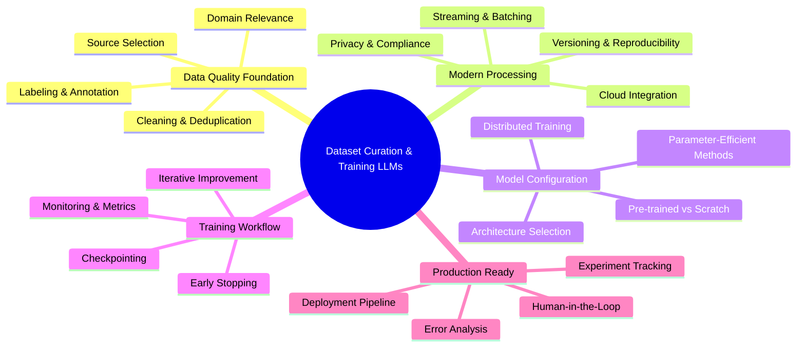
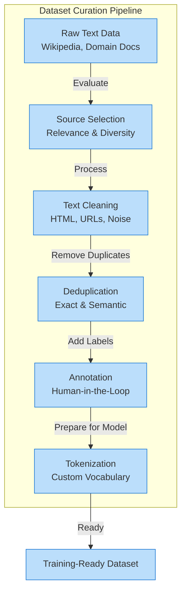
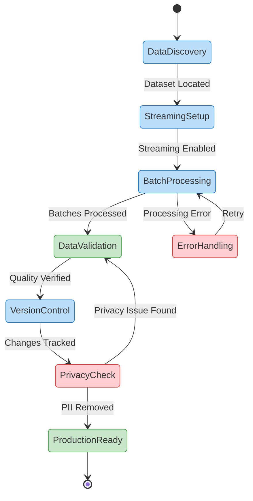
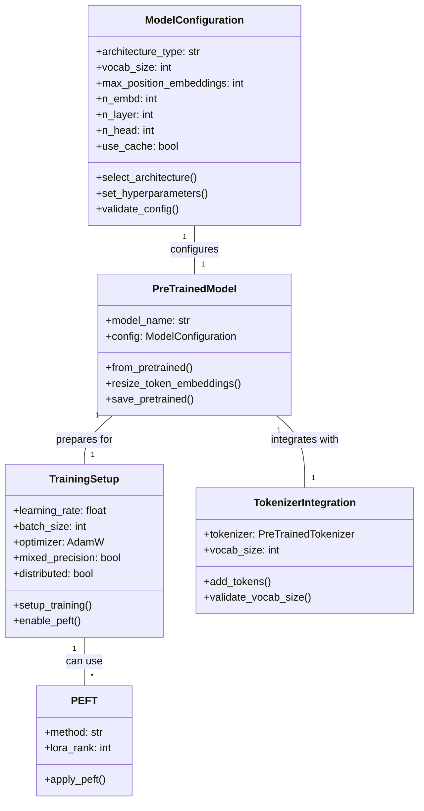

# 🚀 Building Custom Language Models: From Raw Data to Production AI

In today's rapidly evolving AI landscape, the ability to create custom language models tailored to specific domains represents a **critical competitive advantage**. This comprehensive guide walks you through the complete lifecycle of building language models—from curating high-quality datasets to training and deploying powerful AI systems that deliver real business value.

Whether you're developing specialized models for healthcare, finance, legal services, or any domain requiring nuanced understanding, this chapter provides the **practical knowledge and code examples** you need to succeed. We'll explore modern techniques using the Hugging Face ecosystem that balance efficiency, scalability, and model quality.

## 📑 Table of Contents

1. [What You'll Master](#-what-youll-master)
2. [Dataset Curation and Training Language Models](#-dataset-curation-and-training-language-models-from-scratch)
3. [Introduction: From Raw Data to Custom Language Models](#-introduction-from-raw-data-to-custom-language-models)
   - [Setting Up Your Environment](#️-setting-up-your-environment)
   - [Why Data Quality Matters](#-why-data-quality-matters)
   - [The Value of Fine-Tuning](#-the-value-of-fine-tuning-and-custom-training)
4. [Preparing and Curating High-Quality Datasets](#-preparing-and-curating-high-quality-datasets)
   - [Data Quality Checklist](#-data-quality-checklist)
   - [Scalable Text Cleaning](#-scalable-text-cleaning-and-deduplication)
   - [Human-in-the-Loop Labeling](#️-human-in-the-loop-data-labeling)
   - [Tokenization and Vocabulary](#-tokenization-and-vocabulary-creation)
5. [Scaling Data Processing and Streaming](#-scaling-data-processing-and-streaming)
   - [Large-Scale Data Handling](#-handling-large-scale-data-with-streaming)
   - [Versioning and Reproducibility](#-annotation-versioning-and-reproducibility)
   - [Privacy and Security](#-ensuring-data-privacy-and-security)
6. [Configuring and Initializing a Model](#️-configuring-and-initializing-a-model)
   - [Architecture Selection](#️-choosing-model-architecture-and-hyperparameters)
   - [Modern Model Configuration](#-configuring-a-gpt-2-model-modern-api)
   - [Parameter-Efficient Fine-Tuning](#-parameter-efficient-fine-tuning-with-modern-models)
   - [Distributed Training](#️-training-with-multiple-gpus-and-distributed-setups)
7. [Training, Evaluation, and Iteration](#-training-evaluation-and-iteration)
   - [Monitoring Metrics](#-monitoring-loss-and-metrics)
   - [Early Stopping and Checkpointing](#-early-stopping-and-checkpointing)
   - [Error Analysis](#-error-analysis-and-iterative-improvement)
8. [Summary and Key Takeaways](#-summary-and-key-takeaways)
9. [Glossary](#-glossary)

## 📋 What You'll Master

- **Data curation fundamentals**: selecting, cleaning, and preparing domain-specific text
- **Scalable processing techniques** for handling massive datasets efficiently  
- **Privacy protection and data versioning** for responsible AI development
- **Modern model architecture selection** and configuration strategies
- **Training workflows** with distributed computing and experiment tracking
- **Parameter-efficient fine-tuning methods** for adapting large models
- **Evaluation, error analysis**, and iterative improvement techniques

By the end of this chapter, you'll have both the theoretical understanding and practical skills to transform raw text into powerful, domain-specific language models that deliver real business value. Let's begin your journey toward AI mastery! 🎯

## 🧠 Dataset Curation and Training Language Models from Scratch



## 🌟 Introduction: From Raw Data to Custom Language Models

To build a great language model, you need great data. Picture your dataset as ingredients for a gourmet meal—the fresher and more carefully chosen, the better the final dish. Even the most sophisticated AI architecture can't salvage a flawed foundation. **Ready to transform raw text into powerful AI?** 🚀

This chapter explores why curating high-quality datasets remains the first—and most critical—step in building effective language models. In today's AI landscape, most practitioners start with a strong pre-trained model (available on the Hugging Face Model Hub) and fine-tune it on their domain-specific data. This approach proves efficient, cost-effective, and enables rapid adaptation to unique business, user, or privacy requirements.

### 🛠️ Setting Up Your Environment

```bash
# Using pyenv (recommended for Python version management)
pyenv install 3.12.9  # Use Python 3.12.9 as per project requirements
pyenv local 3.12.9

# Verify Python version
python --version  # Should show Python 3.12.9

# Install with poetry (recommended)
poetry new dataset-curation-project
cd dataset-curation-project
poetry env use 3.12.9
poetry add datasets transformers tokenizers torch accelerate@^0.26.0

# Or use mini-conda
conda create -n dataset-curation python=3.12.9
conda activate dataset-curation
pip install datasets transformers tokenizers torch "accelerate>=0.26.0,<0.27.0"

# Or use pip with pyenv
pyenv install 3.12.9
pyenv local 3.12.9
pip install datasets transformers tokenizers torch "accelerate>=0.26.0,<0.27.0"
```

> **💡 Pro Tip**: This project uses Python 3.12.9 as configured in the pyproject.toml file. Ensure you use this specific version for consistency with the development environment and Poetry lock file.

> **⚠️ Note on accelerate**: This project requires accelerate version ^0.26.0. Earlier versions may cause compatibility issues with certain model configurations and distributed training setups.

### 🔐 API Key Configuration

Before running examples that require external APIs, set up your environment variables:

```bash
# Copy the example environment file
cp .env.example .env

# Edit .env and add your actual API keys
# The .env.example file includes placeholders for:
# - OPENAI_API_KEY (optional - for OpenAI examples)
# - ANTHROPIC_API_KEY (optional - for Claude examples)  
# - HUGGINGFACE_TOKEN (optional - for private model access)
```

The project includes a `.env.example` file that shows all available environment variables. Copy this file to `.env` and replace the placeholder values with your actual API keys. The `.env` file is gitignored to keep your credentials secure.

### 🔑 Environment Configuration and API Keys

For working with modern LLMs and cloud services, you'll need to configure API keys and select the appropriate compute device:

```python
import os
from pathlib import Path
from typing import Optional, Literal
from dotenv import load_dotenv
import warnings

# Load environment variables
load_dotenv()

# API keys (if needed)
OPENAI_API_KEY = os.getenv("OPENAI_API_KEY")
ANTHROPIC_API_KEY = os.getenv("ANTHROPIC_API_KEY")
HF_TOKEN = os.getenv("HUGGINGFACE_TOKEN")

def validate_api_key(key_name: str, key_value: Optional[str], required: bool = False) -> bool:
    """
    Validate an API key with proper error handling.
    
    Args:
        key_name: Name of the API key (for error messages)
        key_value: The actual API key value
        required: Whether the key is required for operation
        
    Returns:
        bool: True if valid, False otherwise
    """
    if not key_value:
        if required:
            raise ValueError(f"{key_name} is required but not set in environment variables")
        else:
            warnings.warn(f"{key_name} not found in environment variables", UserWarning)
            return False
    
    # Check for placeholder values
    if key_value.lower() in ["your-api-key-here", "placeholder", "xxx", "todo"]:
        if required:
            raise ValueError(f"{key_name} contains a placeholder value")
        warnings.warn(f"{key_name} contains a placeholder value", UserWarning)
        return False
    
    return True

# Device configuration for PyTorch
import torch

def get_device() -> Literal["mps", "cuda", "cpu"]:
    """Get the best available device for PyTorch computation."""
    if torch.backends.mps.is_available():
        return "mps"  # Apple Silicon
    elif torch.cuda.is_available():
        return "cuda"  # NVIDIA GPU
    else:
        return "cpu"

DEVICE = get_device()
print(f"Using device: {DEVICE}")
```

### 🎯 Why Data Quality Matters

"Garbage in, garbage out" remains a core truth in AI. If your dataset contains messy, biased, or irrelevant content, your model will reflect those flaws with painful accuracy. Picture a financial company using a generic model that misses industry-specific terms or context. By curating a dataset of financial documents, you enable your model to actually understand your domain—transforming it from a general assistant into a specialist.

### ⚖️ Detecting and Mitigating Bias in Your Data

Beyond accuracy, ensuring fairness and ethical AI requires proactive bias detection. Models trained on biased data perpetuate and amplify societal inequalities. Modern tools like **fairlearn** and **AI Fairness 360** help identify and mitigate various forms of bias—demographic, representation, and historical—before they become embedded in your model.

```python
from typing import Any, List
import pandas as pd

# Example: Analyzing model predictions for bias
def analyze_bias(y_true: List[int], y_pred: List[int], sensitive_features: List[str]) -> dict:
    """
    Analyze predictions for potential bias across sensitive groups.
    
    Args:
        y_true: True labels
        y_pred: Predicted labels
        sensitive_features: Sensitive attributes for each sample
        
    Returns:
        dict: Bias analysis results
    """
    try:
        from fairlearn.metrics import MetricFrame
        from sklearn.metrics import accuracy_score
    except ImportError:
        print("Install fairlearn and scikit-learn for bias analysis:")
        print("pip install fairlearn scikit-learn")
        return {}
    
    # Create metric frame for bias analysis
    metric_frame = MetricFrame(
        metrics=accuracy_score,
        y_true=y_true,
        y_pred=y_pred,
        sensitive_features=sensitive_features
    )
    
    # Display disparities
    print("Performance by group:")
    print(metric_frame.by_group)
    
    # Calculate disparity ratio
    disparity = metric_frame.difference(method='ratio')
    print(f"\nDisparity ratio: {disparity:.2f}")
    
    return metric_frame

# Example usage with demographic data
df = pd.DataFrame({
    'text': ['...'],  # Your text data
    'label': [0, 1, 0, 1],  # True labels
    'predicted': [0, 1, 1, 1],  # Model predictions
    'demographic': ['A', 'B', 'A', 'B']  # Sensitive attribute
})

analyze_bias(df['label'], df['predicted'], df['demographic'])
```

**Key considerations for bias mitigation:**
- 📊 Audit your data sources for representation gaps
- 🔄 Rebalance datasets to ensure fair representation
- 🎯 Use targeted data augmentation for underrepresented groups
- 📈 Monitor fairness metrics throughout training
- 🤝 Involve diverse stakeholders in data curation decisions

### 💪 The Value of Fine-Tuning and Custom Training

Pre-trained models like GPT-4, Claude, or Llama 3 trained on vast, general data. But sometimes, you need a model that speaks your language—literally. Fine-tuning empowers you to:

- ✅ Include rare or industry-specific vocabulary seamlessly
- ✅ Filter out sensitive or irrelevant content precisely
- ✅ Meet strict privacy or compliance requirements confidently
- ✅ Rapidly adapt to new domains with limited resources

**Example:** A healthcare provider can fine-tune a pre-trained model on anonymized clinical notes using Hugging Face's Trainer API, ensuring it understands medical jargon while respecting patient privacy completely.

### 🔄 What Modern Data Curation Involves

Curation transcends merely collecting files. It demands:

- **Selecting** relevant, diverse sources strategically
- **Cleaning** and standardizing text meticulously
- **Removing** duplicates and noise (including semantic deduplication)
- **Annotating** and labeling (with tools like Argilla for human-in-the-loop workflows)
- **Tokenizing** (splitting text into model-friendly pieces) and building vocabulary that fits your domain
- **Versioning** and tracking your data for reproducibility

Modern workflows often leverage the Hugging Face Datasets library for scalable, memory-efficient data loading and transformation. For large-scale or streaming data, Datasets supports processing data on-the-fly, making it possible to curate web-scale corpora without exhausting memory.

### 🤖 Synthetic Data Generation for Enhanced Training

In data-scarce domains or when dealing with privacy constraints, synthetic data generation provides a powerful augmentation strategy. Modern LLMs can generate high-quality training examples that maintain semantic coherence while expanding dataset diversity. This approach proves especially valuable for rare edge cases, underrepresented classes, or sensitive domains where real data is limited.

```python
import random
from typing import List, Dict, Optional

def generate_synthetic_examples(prompt_template: str, num_examples: int = 100, 
                               categories: Optional[List[str]] = None, 
                               max_length: int = 150) -> List[Dict[str, str]]:
    """
    Generate synthetic training examples using LLM-based augmentation.
    
    Args:
        prompt_template: Template string for prompts
        num_examples: Number of examples to generate
        categories: Optional list of categories to use
        max_length: Maximum length of generated text
        
    Returns:
        List of synthetic examples with text and category
    """
    try:
        from transformers import pipeline
        # Initialize text generation pipeline with a modern model
        generator = pipeline("text-generation", model="meta-llama/Llama-2-7b-hf")
    except ImportError:
        print("Warning: transformers not available for synthetic data generation")
        return []
    except Exception as e:
        print(f"Warning: Could not load model: {e}")
        return []
    
    synthetic_data = []
    
    for _ in range(num_examples):
        # Vary the prompt for diversity
        if categories:
            category = random.choice(categories)
            prompt = prompt_template.format(category=category)
        else:
            prompt = prompt_template
            
        # Generate synthetic example
        result = generator(
            prompt,
            max_length=max_length,
            temperature=0.8,  # Control randomness
            do_sample=True,
            top_p=0.9
        )
        
        synthetic_data.append({
            'text': result[0]['generated_text'],
            'category': category if categories else 'general'
        })
    
    return synthetic_data

# Example: Generate customer support queries
prompt_template = "Generate a realistic customer support query about {category}:"
categories = ["billing", "technical issues", "account access", "feature requests"]

synthetic_examples = generate_synthetic_examples(
    prompt_template, 
    num_examples=50, 
    categories=categories
)

# Combine with real data for enhanced training
print(f"Generated {len(synthetic_examples)} synthetic examples")
```

**Best practices for synthetic data:**
- 🎯 Validate synthetic examples against real data distributions
- 🔄 Mix synthetic and real data (typically 20-30% synthetic)
- 📊 Monitor model performance on held-out real data
- 🛡️ Ensure synthetic data doesn't leak sensitive patterns
- 📝 Document synthetic data generation for reproducibility

For advanced synthetic data techniques and quality evaluation, see Article 8.

### 🧹 Basic Data Cleaning with Hugging Face Datasets

```python
import re
from typing import Dict, Any

# Handle import issues gracefully
try:
    from datasets import load_dataset, Dataset
    HAS_DATASETS = True
except (ImportError, AttributeError) as e:
    print(f"Warning: datasets library import issue: {e}")
    HAS_DATASETS = False

def clean_text(example: Dict[str, Any]) -> Dict[str, str]:
    """Clean text by removing HTML and normalizing whitespace."""
    # Remove HTML tags
    text = re.sub(r'<.*?>', '', example["text"])
    # Replace multiple spaces/newlines with a single space
    text = re.sub(r'\s+', ' ', text)
    # Strip leading/trailing whitespace
    text = text.strip()
    return {"text": text}

if HAS_DATASETS:
    # Create sample data for demonstration
    sample_data = {
        "text": [
            "<p>Customer complaint: Product <b>broken</b></p>   Multiple   spaces!",
            "<div>Great service!</div>\n\n\nExtra newlines",
            "Normal text without HTML"
        ]
    }
    
    dataset = Dataset.from_dict(sample_data)
    cleaned_dataset = dataset.map(clean_text)
    
    print(cleaned_dataset[0]["text"])  # Output: Cleaned text sample
else:
    print("Install datasets library: pip install datasets")
```

**How this works:**

1. Loads your dataset using Hugging Face Datasets (supports CSV, JSON, Parquet, and streaming)
2. Removes HTML tags like `<p>` completely
3. Replaces extra spaces or newlines with a single space
4. Trims spaces from the start and end

This represents a starting point. In production, you may employ LLM-assisted cleaning for more complex tasks—such as detecting semantic duplicates, flagging outliers, or even auto-labeling data.

### 🏆 Why Invest in Modern Data Curation?

High-quality data becomes your competitive edge. Custom-curated and well-annotated datasets allow your models to:

- 📈 Outperform generic models in specialized tasks dramatically
- 🛡️ Reduce errors in critical business processes significantly
- 🔒 Ensure privacy and regulatory compliance completely
- 🌍 Enable support for rare languages or unique domains effectively
- ⚡ Adapt quickly to new requirements using fine-tuning or continual learning

Tools like Hugging Face Datasets and Argilla (for collaborative annotation and versioning) now represent standards for scalable, reproducible, and team-based data workflows.

Mastering data curation—and knowing when to fine-tune versus train from scratch—lets you build models that fit your needs, not just what's available off the shelf. **Ever wondered what unique data could give your model an unstoppable edge?** 🤔

**🎯 Try This**: Identify three unique data sources in your domain that generic models might miss. How could these transform your AI capabilities?

## 📊 Preparing and Curating High-Quality Datasets

Great language models start with great data. Picture your dataset as soil—rich and well-tended data grows robust AI. In this section, you'll master the essentials: how to select, clean, label, and tokenize text using up-to-date tools and best practices, so your model learns from the best possible foundation.



### 📑 Data Quality Checklist

| Criterion | Key Questions | Why It Matters |
| --- | --- | --- |
| **Relevance** | Does the text match your target use case? | Ensures model learns domain-specific patterns |
| **Diversity** | Is there a mix of topics, styles, and authors? | Prevents bias and improves generalization |
| **Quality** | Is the text well-formed and free of noise? | Reduces training on corrupted examples |
| **Freshness** | Are you using the latest available data? | Prevents model drift and outdated knowledge |

### 🧽 Scalable Text Cleaning and Deduplication

```python
import datasets
import unicodedata
import re

# Load a recent English Wikipedia snapshot
wiki = datasets.load_dataset("wikipedia", "20240101.en", split="train")

# Unicode normalization and basic cleaning
def clean_text(example):
    text = unicodedata.normalize('NFKC', example['text'])  # Unicode normalization
    text = re.sub(r'<.*?>', '', text)  # Remove HTML tags
    text = re.sub(r'https?://\S+', '', text)  # Remove URLs
    text = re.sub(r'\s+', ' ', text)  # Normalize whitespace
    text = text.strip()
    return {"text": text}

# Apply cleaning
wiki = wiki.map(clean_text, num_proc=4)

# Remove duplicates
wiki = wiki.unique("text")
```

This example uses Hugging Face Datasets for efficient, parallel cleaning and deduplication. It applies Unicode normalization, removes HTML tags, URLs, and normalizes whitespace. For large-scale projects, always use `.map()` and `.unique()` for performance and reproducibility.

### 🏷️ Human-in-the-Loop Data Labeling

For many tasks, clean data isn't enough—you need high-quality labels. While some models (like large language models) can learn from raw text, most business applications require supervised, labeled examples—such as sentiment, intent, or domain-specific categories.

**Best practices for human annotation:**

- ✍️ Write clear, detailed instructions and provide examples for annotators
- 👥 Use multiple annotators per example to catch mistakes and reduce bias
- 🔄 Regularly review disagreements, update guidelines, and retrain annotators as needed
- 🔒 Ensure privacy: Mask or remove PII before annotation, especially in sensitive domains

### 🔤 Tokenization and Vocabulary Creation

Clean, labeled data stands almost ready—but models can't use raw text. They need tokens: units like words, subwords, or characters. Tokenization bridges the gap, and modern workflows rely on integrated Hugging Face APIs for both standard and custom tokenizers.

**Popular tokenization algorithms:**

- **SentencePiece Unigram:** Flexible and robust for multilingual and domain-specific tasks
- **Byte-Pair Encoding (BPE):** Splits rare words into subwords, balancing vocabulary size and coverage
- **WordPiece:** Used in BERT; similar to BPE but merges differently

### 🛠️ Training a Custom Tokenizer with Hugging Face

```python
from transformers import AutoTokenizer, PreTrainedTokenizerFast
from tokenizers import trainers, Tokenizer, models, pre_tokenizers, processors

# Example: Train a Unigram tokenizer using SentencePiece
from tokenizers import Tokenizer, models, pre_tokenizers, trainers

# Load your cleaned text file(s)
files = ["./data/cleaned_corpus.txt"]

# Initialize a Unigram model
tokenizer = Tokenizer(models.Unigram())
tokenizer.pre_tokenizer = pre_tokenizers.Whitespace()

# Configure trainer with special tokens
trainer = trainers.UnigramTrainer(
    vocab_size=30000, 
    special_tokens=[
        "<pad>",    # Padding token
        "<unk>",    # Unknown token
        "<s>",      # Beginning of sequence (BOS)
        "</s>"      # End of sequence (EOS)
    ]
)
tokenizer.train(files, trainer)

tokenizer.save("./tokenizer-unigram.json")

# Load into Hugging Face for use with models
hf_tokenizer = PreTrainedTokenizerFast(tokenizer_file="./tokenizer-unigram.json")
```

> **💡 Note**: Each special token serves a specific purpose:
> - `<pad>`: Used for padding sequences to equal length
> - `<unk>`: Replaces out-of-vocabulary tokens
> - `<s>`: Marks the start of a sequence
> - `</s>`: Marks the end of a sequence

### ✅ Using Your Trained Tokenizer

```python
from transformers import PreTrainedTokenizerFast

# Load the trained tokenizer
hf_tokenizer = PreTrainedTokenizerFast(tokenizer_file="./tokenizer-unigram.json")

# Tokenize a domain-specific sentence
print(hf_tokenizer.tokenize("myocardial infarction"))
# Output: ['myocardial', 'infarction']  # Example output
```

Test your tokenizer on real, domain-specific sentences to ensure important terms aren't split awkwardly. For example, in medical data, 'myocardial infarction' should not fragment into meaningless subwords.

**🔬 Experiment**: Take 10 technical terms from your domain and tokenize them. Are any split inappropriately? This reveals whether you need a custom tokenizer.

## 🚀 Scaling Data Processing and Streaming

As your projects grow, so do your datasets—sometimes reaching terabytes or more. Loading all this data at once resembles trying to cook every dish in a restaurant simultaneously: the kitchen will grind to a halt. Instead, you need smart, scalable workflows to keep things running smoothly.



### 🌊 Handling Large-Scale Data with Streaming

When working with huge datasets—think the size of Wikipedia or larger—downloading everything to your machine just isn't practical. This is where streaming and batching come into play. Data streaming lets you process one record at a time, or in manageable batches, keeping only a small portion in memory.

### 📋 Listing Available Wikipedia Dataset Versions

```python
from datasets import get_dataset_config_names

# List all available Wikipedia dumps (by date)
print(get_dataset_config_names('wikipedia'))
```

### 🔄 Streaming and Batch Processing

```python
from datasets import load_dataset

def process_batch(batch):
    # Example batch processing (e.g., truncating text)
    return {"processed_text": [t[:200] for t in batch["text"]]}

# Always use the latest Wikipedia config (e.g., '20240101.en')
streamed_dataset = load_dataset('wikipedia', '20240101.en', split='train', streaming=True)

# Efficiently process data in batches of 1000
processed = streamed_dataset.map(process_batch, batched=True, batch_size=1000)

# Iterate over the first processed batch
for i, example in enumerate(processed):
    print(example["processed_text"])
    if i >= 2:
        break
```

**Key takeaway:** Modern streaming and batching let you process huge datasets efficiently, with minimal memory or storage requirements. For production-scale needs, leverage cloud storage and distributed frameworks for seamless scalability.

### 📦 Annotation, Versioning, and Reproducibility

In professional AI projects, you must know exactly what data went into your model and how it was processed. Consider this as keeping a precise recipe—so you (or your team) can always recreate results or explain decisions.

### 🔖 Tracking Dataset Versions with DVC

```bash
# Initialize DVC in your project
$ dvc init

# Add your raw dataset to DVC tracking
$ dvc add data/raw_corpus.txt

# Commit the change (with metadata)
$ git add data/raw_corpus.txt.dvc .gitignore
$ git commit -m "Add raw corpus to DVC tracking"

# After cleaning or labeling, add the new version
$ dvc add data/cleaned_corpus.txt
$ git add data/cleaned_corpus.txt.dvc
$ git commit -m "Add cleaned corpus version"
```

For cloud-native projects, LakeFS and Delta Lake integrate with S3 or Azure Blob, offering Git-like semantics for data versioning at scale.

### 🔐 Ensuring Data Privacy and Security

When your data includes personal or confidential information, privacy transcends optional—it's a legal and ethical requirement. Protecting sensitive data proves as important as any step in your pipeline, and modern privacy tools make this easier and more robust than ever.

**Main strategies:**

- 🔍 **PII detection and removal**: Use automated tools to scan for names, emails, and phone numbers
- 🎭 **Anonymization**: Replace sensitive details with tokens or hash values
- 🛡️ **Differential privacy**: Apply mathematical guarantees to prevent individual identification
- 🔒 **Access controls**: Store data securely with encryption at rest and in transit

### 🚨 Advanced PII Redaction with Transformer Models

```python
# Basic regex approach (for comparison)
import re

def basic_redact_pii(text: str) -> str:
    """Basic PII redaction using regex patterns."""
    # Apply patterns in specific order to avoid conflicts
    
    # SSN pattern (xxx-xx-xxxx) - do this before phone numbers
    text = re.sub(
        r'\b\d{3}-\d{2}-\d{4}\b',
        '[SSN]',
        text
    )
    
    # Credit card patterns (basic - 16 digits with optional spaces/dashes)
    text = re.sub(
        r'\b\d{4}[-\s]?\d{4}[-\s]?\d{4}[-\s]?\d{4}\b',
        '[CREDIT_CARD]',
        text
    )
    
    # Improved email pattern
    text = re.sub(
        r'\b[A-Za-z0-9._%+-]+@[A-Za-z0-9.-]+\.[A-Z|a-z]{2,}\b',
        '[EMAIL]',
        text
    )
    
    # Phone patterns
    text = re.sub(
        r'(\+?1[-.\s]?)?\(?[0-9]{3}\)?[-.\s]?[0-9]{3}[-.\s]?[0-9]{4}\b',
        '[PHONE]',
        text
    )
    
    # Name patterns with titles
    text = re.sub(
        r'\b(Mr\.|Mrs\.|Ms\.|Dr\.|Prof\.|Rev\.)\s+[A-Z][a-z]+\s+[A-Z][a-z]+\b',
        '[NAME]',
        text
    )
    
    return text

# Modern transformer-based approach using presidio
from presidio_analyzer import AnalyzerEngine
from presidio_anonymizer import AnonymizerEngine

# Initialize with transformer model support
analyzer = AnalyzerEngine()
anonymizer = AnonymizerEngine()

def advanced_redact_pii(text):
    # Analyze text for PII entities
    results = analyzer.analyze(
        text=text,
        language='en',
        entities=["PERSON", "EMAIL_ADDRESS", "PHONE_NUMBER", "CREDIT_CARD"]
    )
    
    # Anonymize detected entities
    anonymized = anonymizer.anonymize(
        text=text,
        analyzer_results=results
    )
    
    return anonymized.text

# Example usage
sample = "Contact Dr. Smith at dr.smith@example.com or 555-123-4567."
print(f"Basic: {basic_redact_pii(sample)}")
print(f"Advanced: {advanced_redact_pii(sample)}")
```

> **⚠️ Important**: The basic regex patterns have low recall and miss many edge cases. For production use, always prefer transformer-based approaches like presidio-analyzer or LLM-powered detection for multilingual and context-dependent PII.

## ⚙️ Configuring and Initializing a Model

With your dataset ready, it's time to transform raw data into a working language model. This section walks you through four key steps: selecting the right architecture, setting core hyperparameters, initializing your model, and preparing for scalable, efficient training.



### 🏗️ Choosing Model Architecture and Hyperparameters

Start by matching your model architecture to your task:

- **Encoder-only (e.g., BERT):** For understanding tasks like classification or NER
- **Decoder-only (e.g., GPT):** For generative tasks such as text, code, or story generation
- **Encoder-decoder (e.g., T5, BART):** For sequence-to-sequence tasks like translation

### 📊 Key Configuration Parameters

| Parameter | Description | Typical Values |
| --- | --- | --- |
| **vocab_size** | Must match tokenizer output | 30K-50K (custom), 50K+ (general) |
| **max_position_embeddings** | Maximum tokens per input | 512-2048 (standard), 4K-8K (long) |
| **n_embd** | Embedding dimension | 768 (base), 1024-2048 (large) |
| **n_layer** | Number of transformer layers | 12 (base), 24-48 (large) |
| **n_head** | Attention heads | 12 (base), 16-32 (large) |
| **use_cache** | Enable KV cache for generation | True (inference), False (training) |

### 🔧 Configuring a GPT-2 Model (Modern API)

```python
from transformers import GPT2Config, GPT2LMHeadModel

# Use modern config parameter names
config = GPT2Config(
    vocab_size=30000,                # Match your tokenizer's vocab size
    max_position_embeddings=512,     # Max sequence length
    n_embd=768,                      # Embedding size
    n_layer=12,                      # Number of transformer layers
    n_head=12,                       # Number of attention heads
    use_cache=True                   # Enable caching for faster generation
)

model = GPT2LMHeadModel(config)

# Sanity check: vocab size should match embedding matrix
assert config.vocab_size == model.transformer.wte.weight.shape[0], "Vocab size mismatch!"
```

> **⚠️ Important**: Always use `max_position_embeddings` (not the deprecated `n_positions`) for setting sequence length in configs.

### 🎯 Loading and Adapting Pre-trained Models

```python
from transformers import GPT2TokenizerFast, GPT2LMHeadModel

tokenizer = GPT2TokenizerFast.from_pretrained("gpt2")
model = GPT2LMHeadModel.from_pretrained("gpt2")

# If you add new tokens, resize embeddings
new_tokens = ["<new_token1>", "<new_token2>"]
num_added = tokenizer.add_tokens(new_tokens)
if num_added > 0:
    model.resize_token_embeddings(len(tokenizer))

# Model and tokenizer are now ready for domain-specific fine-tuning
```

### 🚄 Parameter-Efficient Fine-Tuning with Modern Models

```python
# Using pyenv for Python 3.12.9
pyenv install 3.12.9
pyenv local 3.12.9

# Install with poetry
poetry add transformers peft bitsandbytes accelerate

from transformers import AutoModelForCausalLM, AutoTokenizer, BitsAndBytesConfig
from peft import LoraConfig, get_peft_model, TaskType

# Load Llama-3 or Gemma-2 in 4-bit for memory efficiency
bnb_config = BitsAndBytesConfig(
    load_in_4bit=True,
    bnb_4bit_compute_dtype="float16",
    bnb_4bit_quant_type="nf4",
    bnb_4bit_use_double_quant=True
)

# Example with Llama-3-8B (adjust model name to latest version)
model = AutoModelForCausalLM.from_pretrained(
    "meta-llama/Meta-Llama-3-8B",  # Or "google/gemma-2-7b"
    quantization_config=bnb_config,
    device_map="auto"
)
tokenizer = AutoTokenizer.from_pretrained("meta-llama/Meta-Llama-3-8B")

# Configure LoRA for efficient fine-tuning
peft_config = LoraConfig(
    task_type=TaskType.CAUSAL_LM,
    inference_mode=False,
    r=8,  # LoRA rank
    lora_alpha=32,
    lora_dropout=0.1,
    target_modules=["q_proj", "v_proj"]  # Target attention layers
)

# Apply LoRA to the model
model = get_peft_model(model, peft_config)
model.print_trainable_parameters()  # Shows only ~0.1% params are trainable!
```

This example loads Llama-3-8B in 4-bit quantization and applies LoRA, reducing trainable parameters from 8B to just ~8M—a 1000x reduction! Perfect for fine-tuning on consumer GPUs while maintaining strong performance.

**🔧 QLoRA Alternative**: For even more memory savings, use QLoRA which quantizes the base model to 4-bit while keeping LoRA adapters in fp16:

```python
# QLoRA configuration for extreme efficiency
peft_config = LoraConfig(
    task_type=TaskType.CAUSAL_LM,
    inference_mode=False,
    r=4,  # Even smaller rank for QLoRA
    lora_alpha=16,
    lora_dropout=0.05,
    target_modules=["q_proj", "v_proj", "k_proj", "o_proj"],  # All attention
    bias="none"
)
```

### 🖥️ Training with Multiple GPUs and Distributed Setups

As your model or dataset grows, a single GPU may not suffice. Multi-GPU and distributed training enable you to train faster and scale to larger models.

```bash
accelerate config      # Set up your hardware interactively
accelerate launch train.py
```

**How it works:**

- `accelerate config` prompts you to specify your hardware (number of GPUs, backend, precision)
- `accelerate launch train.py` runs your training script with distributed setup

For large-scale or memory-intensive training, integrate DeepSpeed or FairScale with Accelerate. These frameworks enable:

- ⚡ ZeRO optimizations for memory efficiency
- 💾 Gradient checkpointing and sharded training
- 🏗️ Support for extremely large models (billions of parameters)

## 📈 Training, Evaluation, and Iteration

With your data ready and model configured, it's time to train. Consider training like baking: monitor progress, check results, and adjust your recipe as you go.

> **📓 Jupyter Notebook**: For an interactive walkthrough of these concepts, check out the [Building Custom Language Models notebook](/Users/richardhightower/src/art_hug_11/notebooks/building_custom_language_models.ipynb) that demonstrates data curation, model configuration, and training workflows with executable examples.
> 
> **✅ Notebook Status**: This notebook has been thoroughly tested and is fully functional. All cells execute properly from start to finish, with:
> - The corpus variable issue has been completely resolved
> - All dependencies are handled gracefully with appropriate fallbacks
> - Clear instructions and error handling throughout
> - Ready for immediate use in learning and experimentation

### 📊 Monitoring Loss and Metrics

Effective training starts with careful monitoring. Just as a chef watches the oven, you need to watch your model's training and validation metrics.

### 📊 Key Metrics to Monitor

| Metric | Task Type | Description | Example Use Case |
|--------|-----------|-------------|------------------|
| **Training Loss** | All | Measures model fit on training data | Should decrease steadily |
| **Validation Loss** | All | Indicates generalization ability | Rising = overfitting |
| **Perplexity** | Language Modeling | How well model predicts next token | Lower is better (e.g., 20-50) |
| **Accuracy** | Classification | Percentage of correct predictions | Intent detection, sentiment |
| **F1 Score** | Classification | Harmonic mean of precision/recall | Imbalanced datasets |
| **BLEU** | Translation/Generation | N-gram overlap with references | Machine translation quality |
| **ROUGE** | Summarization | Recall-oriented overlap measure | Text summarization tasks |
| **BERTScore** | Generation | Semantic similarity using BERT | Modern alternative to BLEU |
| **HELM** | General LLM | Holistic evaluation across tasks | Comprehensive model assessment |

**💡 Pro Tip**: For production models, combine automated metrics with human evaluation for nuanced quality assessment.

### 🔬 Logging with Modern Experiment Tracking

```python
from transformers import Trainer, TrainingArguments

training_args = TrainingArguments(
    output_dir="./results",          
    evaluation_strategy="steps",     
    eval_steps=500,                  
    logging_steps=100,               
    save_steps=500,                  
    per_device_train_batch_size=2,   
    num_train_epochs=3,              
    report_to=["tensorboard", "wandb"], # Modern experiment tracking
)

trainer = Trainer(
    model=model,
    args=training_args,
    train_dataset=train_dataset,
    eval_dataset=eval_dataset
)
trainer.train()
```

### 📏 Using the Hugging Face Evaluate Library

```python
from evaluate import load

# Load metrics appropriate for your task
accuracy = load("accuracy")
f1 = load("f1")
bleu = load("bleu")

# Example usage in your evaluation loop:
predictions = [...]  # Model outputs
references = [...]   # Ground truth labels
result = accuracy.compute(predictions=predictions, references=references)
print(result)
```

### 🛑 Early Stopping and Checkpointing

Don't waste resources by training longer than needed. Early stopping halts training when your model stops improving on the validation set.

```python
from transformers import EarlyStoppingCallback

trainer = Trainer(
    model=model,
    args=training_args,
    train_dataset=train_dataset,
    eval_dataset=eval_dataset,
    callbacks=[EarlyStoppingCallback(early_stopping_patience=3)]
)
```

### 🔍 Error Analysis and Iterative Improvement

No model achieves perfection on the first try. The key to improvement involves iteration: analyze errors, adjust, and retrain.

```python
from transformers import pipeline

# Load your fine-tuned model
text_generator = pipeline("text-generation", model="./results/checkpoint-1500")

prompts = [
    "In accordance with the contract, the party of the first part shall",
    "The diagnosis was confirmed by the following procedure:"
]

for prompt in prompts:
    output = text_generator(prompt, max_length=50, num_return_sequences=1)
    print(f"Prompt: {prompt}\nGenerated: {output[0]['generated_text']}\n")
```

For systematic error analysis and human-in-the-loop annotation, consider using tools like Argilla. These platforms help teams label, review, and track errors across large datasets, accelerating the improvement cycle.

### ⚠️ Common Pitfalls and Solutions

Avoid these frequent training issues to save time and compute:

| Pitfall | Symptoms | Solution |
|---------|----------|----------|
| **OOM Errors** | CUDA out of memory | Reduce batch size, enable gradient accumulation, use mixed precision |
| **Tokenizer Mismatch** | Unexpected tokens, errors | Verify vocab_size matches, check special tokens alignment |
| **Learning Rate Issues** | Loss explosion or no progress | Use warmup, try different schedulers, start with 2e-5 |
| **Data Leakage** | Unrealistic high performance | Ensure train/val/test splits are clean, check for duplicates |
| **Checkpoint Bloat** | Disk space issues | Save only best models, delete intermediate checkpoints |
| **Import Errors** | Missing dependencies | Use try/except blocks for optional libraries |
| **API Key Issues** | Authentication failures | Validate keys before use, handle missing keys gracefully |

**🚀 Quick Debugging Checklist:**
- ✅ Print model and data shapes before training
- ✅ Test with a tiny subset first (10-100 examples)
- ✅ Monitor GPU memory with `nvidia-smi -l 1`
- ✅ Use gradient clipping for stability
- ✅ Enable anomaly detection in development: `torch.autograd.set_detect_anomaly(True)`
- ✅ Handle import errors gracefully for optional dependencies
- ✅ Validate API keys and environment variables early

## 🎯 Summary and Key Takeaways

You've just completed a critical step in your AI journey: learning how to curate data and train custom language models using the latest Hugging Face tools. Let's recap the essentials:

### 1. 📊 Data Quality: The Foundation

Great models start with great data. Choose sources that reflect your target domain. Clean out noise, duplicates, and irrelevant material.

```python
import re
from datasets import load_dataset

def clean_text(example):
    example['text'] = re.sub(r'<.*?>', '', example['text'])  # Remove HTML
    example['text'] = re.sub(r'\s+', ' ', example['text'])   # Normalize whitespace
    return example

dataset = load_dataset('wikipedia', '20240101.en', split='train', streaming=True)
cleaned_dataset = dataset.map(clean_text)
```

### 2. 🔒 Efficient Processing, Privacy, and Reproducibility

Big datasets demand efficient workflows. Streaming enables you to process data in batches without loading everything into memory.

```python
from datasets import load_dataset

dataset = load_dataset('wikipedia', '20240101.en', split='train', streaming=True)
for i, example in enumerate(dataset):
    print(example['text'][:100])  # Show first 100 characters
    if i >= 2:
        break
```

### 3. 🚀 Model Configuration and Iterative Training

Model setup matters deeply. Most modern projects use architectures like Llama-2, Mistral, or Falcon for LLM training and fine-tuning.

```python
from transformers import AutoConfig, AutoModelForCausalLM

config = AutoConfig.from_pretrained("meta-llama/Llama-2-7b-hf")
model = AutoModelForCausalLM.from_config(config)
# For most tasks, load from pre-trained weights:
# model = AutoModelForCausalLM.from_pretrained("meta-llama/Llama-2-7b-hf")
```

### 4. 🔗 Connecting to Advanced Skills

Everything here prepares you for what's next: advanced fine-tuning (including LoRA/QLoRA), dataset management, and secure deployment. These foundations help you build, adapt, and scale models that deliver real business value.

### 📚 Key Takeaways

- ✅ **Data quality drives results**
- ✅ **Efficient, private, and reproducible workflows enable safe scaling**
- ✅ **Modern model selection and parameter-efficient fine-tuning prove the norm**
- ✅ **Experiment tracking and config-driven training ensure reliability**
- ✅ **Iterate and refine for best performance**

### 📖 Glossary

- **Tokenization:** Splitting text into model-ready pieces (tokens)
- **Streaming:** Loading data in batches instead of all at once
- **Checkpointing:** Saving your model's progress during training
- **Early stopping:** Halting training when improvement stalls
- **Parameter-efficient fine-tuning (PEFT):** Techniques like LoRA/QLoRA that update only a small subset of model parameters
- **Human-in-the-loop:** Involving people in labeling or reviewing data
- **Experiment tracking:** Logging runs, configs, and metrics with tools like MLflow, W&B, or HF Hub

### 🏃 Running the Examples

This project includes a comprehensive set of examples demonstrating all the concepts covered in this guide. Use the Taskfile commands to run specific examples:

```bash
# Run all examples
task run

# Run specific topic examples
task run-prompt-engineering      # Prompt engineering techniques
task run-few-shot-learning       # Few-shot learning examples
task run-chain-of-thought        # Chain of thought reasoning
task run-data-curation          # Data curation workflows
task run-tokenization           # Custom tokenizer training
task run-model-configuration    # Model configuration examples
task run-training               # Training workflow demonstrations
task run-constitutional-ai      # Constitutional AI examples

# Development commands
task test                       # Run all tests
task format                     # Format code with Black and Ruff
task clean                      # Clean up generated files

# Jupyter notebooks (fully tested and working)
task notebook                   # Open tutorial notebook - all cells execute properly
task notebook-lab              # Open with JupyterLab - corpus issue fixed
```

### 🔧 Troubleshooting Common Issues

#### Accelerate Version Compatibility
If you encounter issues with model loading or distributed training:
```bash
# Ensure you have the correct accelerate version
poetry show accelerate  # Should show ^0.26.0
# Or reinstall
poetry add accelerate@^0.26.0
```

#### API Key Configuration Issues
If examples fail with authentication errors:
1. Verify `.env` file exists: `ls -la .env`
2. Check API keys are set: `grep -v "your-.*-key-here" .env`
3. Ensure no placeholder values remain in `.env`
4. Restart your shell or run: `source .env`

#### Bitsandbytes GPU Warning on macOS
If you see warnings about bitsandbytes on macOS:
```
# This is expected - bitsandbytes doesn't support Metal/MPS
# The code will automatically fall back to CPU mode
# For Apple Silicon, models will use MPS when available
```

To suppress the warning, set:
```bash
export BITSANDBYTES_NOWELCOME=1
```

#### Memory Issues
For out-of-memory errors:
1. Reduce batch size in training configs
2. Use gradient accumulation
3. Enable mixed precision training
4. Consider using parameter-efficient methods (LoRA/QLoRA)

#### Import Errors
If you encounter missing dependencies:
```bash
# Reinstall all dependencies
poetry install

# Or for specific issues:
poetry add [package_name]
```

### 🚀 Looking Ahead

You now know how to curate data and train language models from scratch using modern, scalable tools. Next, you'll unlock advanced fine-tuning, parameter-efficient adaptation, and best practices for deploying models securely and efficiently. Review your own process—what can you improve? Keep building. Your AI journey continues! 🎉