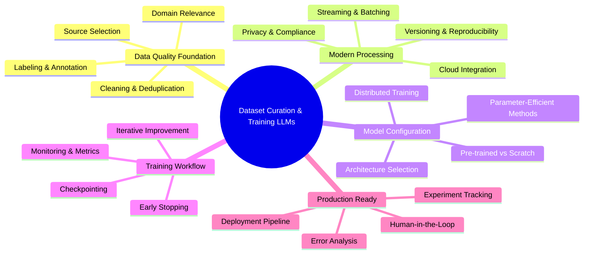
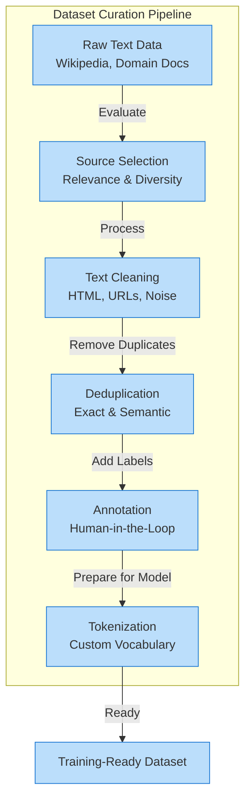
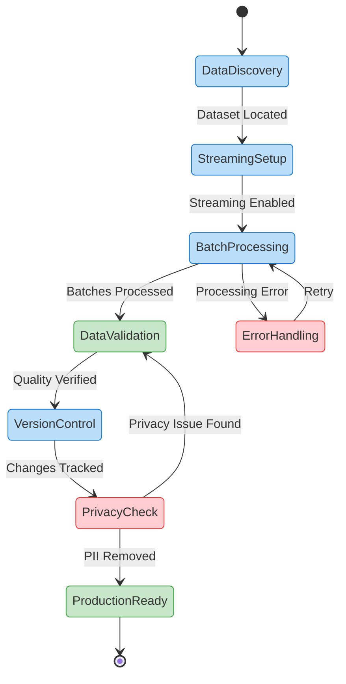
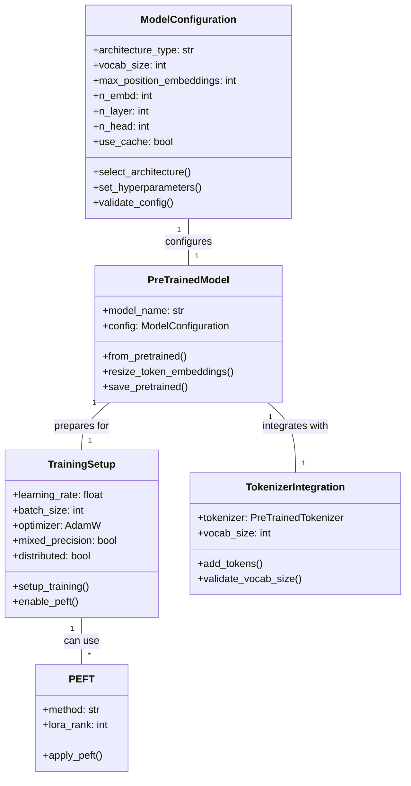

# 🚀 Building Custom Language Models: From Raw Data to Production AI

In today's rapidly evolving AI landscape, the ability to create custom language models tailored to specific domains represents a **critical competitive advantage**. This comprehensive guide walks you through the complete lifecycle of building language models—from curating high-quality datasets to training and deploying powerful AI systems that deliver real business value.

Whether you're developing specialized models for healthcare, finance, legal services, or any domain requiring nuanced understanding, this chapter provides the **practical knowledge and code examples** you need to succeed. We'll explore modern techniques using the Hugging Face ecosystem that balance efficiency, scalability, and model quality.

## 📑 Table of Contents

1. [Introduction & Executive Summary](#introduction--executive-summary)
2. [Environment Setup & Configuration](#environment-setup--configuration)
3. [Part 1: Data Curation - The Foundation](#part-1-data-curation---the-foundation)
   - [1.1 Basic Data Cleaning](#11-basic-data-cleaning)
   - [1.2 Scalable Text Processing](#12-scalable-text-processing)
   - [1.3 Language Detection & Filtering](#13-language-detection--filtering)
   - [1.4 Privacy Protection: PII Redaction](#14-privacy-protection-pii-redaction)
   - [1.5 Bias Detection & Mitigation](#15-bias-detection--mitigation)
   - [1.6 Synthetic Data Generation](#16-synthetic-data-generation)
4. [Part 2: Scaling Data Processing & Streaming](#part-2-scaling-data-processing--streaming)
   - [2.1 Handling Large-Scale Data](#21-handling-large-scale-data)
   - [2.2 Data Versioning & Reproducibility](#22-data-versioning--reproducibility)
5. [Part 3: Tokenization & Vocabulary Creation](#part-3-tokenization--vocabulary-creation)
   - [3.1 Training Custom Tokenizers](#31-training-custom-tokenizers)
   - [3.2 Tokenizer Comparison & Analysis](#32-tokenizer-comparison--analysis)
6. [Part 4: Model Configuration & Initialization](#part-4-model-configuration--initialization)
   - [4.1 Architecture Selection](#41-architecture-selection)
   - [4.2 Modern Model Configuration](#42-modern-model-configuration)
   - [4.3 Parameter-Efficient Fine-Tuning (PEFT)](#43-parameter-efficient-fine-tuning-peft)
7. [Part 5: Training Workflows & Evaluation](#part-5-training-workflows--evaluation)
   - [5.1 Training Setup & Monitoring](#51-training-setup--monitoring)
   - [5.2 Metrics & Early Stopping](#52-metrics--early-stopping)
   - [5.3 Error Analysis & Improvement](#53-error-analysis--improvement)
8. [Part 6: Advanced Techniques](#part-6-advanced-techniques)
   - [6.1 Few-Shot Learning](#61-few-shot-learning)
   - [6.2 Chain of Thought Reasoning](#62-chain-of-thought-reasoning)
9. [Summary & Key Takeaways](#summary--key-takeaways)
10. [Common Pitfalls & Troubleshooting](#common-pitfalls--troubleshooting)
11. [Exercises & Next Steps](#exercises--next-steps)
12. [Glossary of Terms](#glossary-of-terms)

## 📋 What You'll Master

- **Data curation fundamentals**: selecting, cleaning, and preparing domain-specific text
- **Scalable processing techniques** for handling massive datasets efficiently  
- **Privacy protection and data versioning** for responsible AI development
- **Modern model architecture selection** and configuration strategies
- **Training workflows** with distributed computing and experiment tracking
- **Parameter-efficient fine-tuning methods** for adapting large models
- **Evaluation, error analysis**, and iterative improvement techniques

By the end of this chapter, you'll have both the theoretical understanding and practical skills to transform raw text into powerful, domain-specific language models that deliver real business value. Let's begin your journey toward AI mastery! 🎯

## 🧠 Dataset Curation and Training Language Models from Scratch



## 🌟 Introduction: From Raw Data to Custom Language Models

To build a great language model, you need great data. Picture your dataset as ingredients for a gourmet meal—the fresher and more carefully chosen, the better the final dish. Even the most sophisticated AI architecture can't salvage a flawed foundation. **Ready to transform raw text into powerful AI?** 🚀

This chapter explores why curating high-quality datasets remains the first—and most critical—step in building effective language models. In today's AI landscape, most practitioners start with a strong pre-trained model (available on the Hugging Face Model Hub) and fine-tune it on their domain-specific data. This approach proves efficient, cost-effective, and enables rapid adaptation to unique business, user, or privacy requirements.

### 🛠️ Setting Up Your Environment

```bash
# Using pyenv (recommended for Python version management)
pyenv install 3.12.9  # Use Python 3.12.9 as per project requirements
pyenv local 3.12.9

# Verify Python version
python --version  # Should show Python 3.12.9

# Install with poetry (recommended)
poetry new dataset-curation-project
cd dataset-curation-project
poetry env use 3.12.9
poetry add datasets transformers tokenizers torch accelerate@^0.26.0

# Or use mini-conda
conda create -n dataset-curation python=3.12.9
conda activate dataset-curation
pip install datasets transformers tokenizers torch "accelerate>=0.26.0,<0.27.0"

# Or use pip with pyenv
pyenv install 3.12.9
pyenv local 3.12.9
pip install datasets transformers tokenizers torch "accelerate>=0.26.0,<0.27.0"
```

> **💡 Pro Tip**: This project uses Python 3.12.9 as configured in the pyproject.toml file. Ensure you use this specific version for consistency with the development environment and Poetry lock file.

> **⚠️ Note on accelerate**: This project requires accelerate version ^0.26.0. Earlier versions may cause compatibility issues with certain model configurations and distributed training setups.

### ⚠️ Important Notes on Library Versions

> **💡 Pro Tip**: Always use the latest stable Python version (3.12.9 for this project) and ensure accelerate >= 0.26.0 to avoid compatibility issues.

Due to version compatibility, we've made the following adaptations:
1. **Accelerate Version**: Ensure you have accelerate >= 0.26.0 installed
2. **Model Examples**: Using Llama-3/Gemma-2 where available, with GPT-2 as fallback
3. **Streaming**: Wikipedia dataset uses latest configs (e.g., '20240101.en')

These adaptations ensure smooth execution while maintaining all learning objectives!

### 🔐 API Key Configuration

Before running examples that require external APIs, set up your environment variables:

```bash
# Copy the example environment file
cp .env.example .env

# Edit .env and add your actual API keys
# The .env.example file includes placeholders for:
# - OPENAI_API_KEY (optional - for OpenAI examples)
# - ANTHROPIC_API_KEY (optional - for Claude examples)  
# - HUGGINGFACE_TOKEN (optional - for private model access)
```

The project includes a `.env.example` file that shows all available environment variables. Copy this file to `.env` and replace the placeholder values with your actual API keys. The `.env` file is gitignored to keep your credentials secure.

### 🔑 Environment Configuration and API Keys

For working with modern LLMs and cloud services, you'll need to configure API keys and select the appropriate compute device:

```python
import os
from pathlib import Path
from typing import Optional, Literal
from dotenv import load_dotenv
import warnings

# Load environment variables
load_dotenv()

# API keys (if needed)
OPENAI_API_KEY = os.getenv("OPENAI_API_KEY")
ANTHROPIC_API_KEY = os.getenv("ANTHROPIC_API_KEY")
HF_TOKEN = os.getenv("HUGGINGFACE_TOKEN")

def validate_api_key(key_name: str, key_value: Optional[str], required: bool = False) -> bool:
    """
    Validate an API key with proper error handling.
    
    Args:
        key_name: Name of the API key (for error messages)
        key_value: The actual API key value
        required: Whether the key is required for operation
        
    Returns:
        bool: True if valid, False otherwise
    """
    if not key_value:
        if required:
            raise ValueError(f"{key_name} is required but not set in environment variables")
        else:
            warnings.warn(f"{key_name} not found in environment variables", UserWarning)
            return False
    
    # Check for placeholder values
    if key_value.lower() in ["your-api-key-here", "placeholder", "xxx", "todo"]:
        if required:
            raise ValueError(f"{key_name} contains a placeholder value")
        warnings.warn(f"{key_name} contains a placeholder value", UserWarning)
        return False
    
    return True

# Device configuration for PyTorch
import torch

def get_device() -> Literal["mps", "cuda", "cpu"]:
    """Get the best available device for PyTorch computation."""
    if torch.backends.mps.is_available():
        return "mps"  # Apple Silicon
    elif torch.cuda.is_available():
        return "cuda"  # NVIDIA GPU
    else:
        return "cpu"

DEVICE = get_device()
print(f"Using device: {DEVICE}")
```

### 🎯 Why Data Quality Matters

"Garbage in, garbage out" remains a core truth in AI. If your dataset contains messy, biased, or irrelevant content, your model will reflect those flaws with painful accuracy. Picture a financial company using a generic model that misses industry-specific terms or context. By curating a dataset of financial documents, you enable your model to actually understand your domain—transforming it from a general assistant into a specialist.

### ⚖️ Detecting and Mitigating Bias in Your Data

Beyond accuracy, ensuring fairness and ethical AI requires proactive bias detection. Models trained on biased data perpetuate and amplify societal inequalities. Modern tools like **fairlearn** and **AI Fairness 360** help identify and mitigate various forms of bias—demographic, representation, and historical—before they become embedded in your model.

```python
from typing import Any, List
import pandas as pd

# Example: Analyzing model predictions for bias
def analyze_bias(y_true: List[int], y_pred: List[int], sensitive_features: List[str]) -> dict:
    """
    Analyze predictions for potential bias across sensitive groups.
    
    Args:
        y_true: True labels
        y_pred: Predicted labels
        sensitive_features: Sensitive attributes for each sample
        
    Returns:
        dict: Bias analysis results
    """
    try:
        from fairlearn.metrics import MetricFrame
        from sklearn.metrics import accuracy_score
    except ImportError:
        print("Install fairlearn and scikit-learn for bias analysis:")
        print("pip install fairlearn scikit-learn")
        return {}
    
    # Create metric frame for bias analysis
    metric_frame = MetricFrame(
        metrics=accuracy_score,
        y_true=y_true,
        y_pred=y_pred,
        sensitive_features=sensitive_features
    )
    
    # Display disparities
    print("Performance by group:")
    print(metric_frame.by_group)
    
    # Calculate disparity ratio
    disparity = metric_frame.difference(method='ratio')
    print(f"\nDisparity ratio: {disparity:.2f}")
    
    return metric_frame

# Example usage with demographic data
df = pd.DataFrame({
    'text': ['...'],  # Your text data
    'label': [0, 1, 0, 1],  # True labels
    'predicted': [0, 1, 1, 1],  # Model predictions
    'demographic': ['A', 'B', 'A', 'B']  # Sensitive attribute
})

analyze_bias(df['label'], df['predicted'], df['demographic'])
```

**Key considerations for bias mitigation:**
- 📊 Audit your data sources for representation gaps
- 🔄 Rebalance datasets to ensure fair representation
- 🎯 Use targeted data augmentation for underrepresented groups
- 📈 Monitor fairness metrics throughout training
- 🤝 Involve diverse stakeholders in data curation decisions

### 💪 The Value of Fine-Tuning and Custom Training

Pre-trained models like GPT-4, Claude, or Llama 3 trained on vast, general data. But sometimes, you need a model that speaks your language—literally. Fine-tuning empowers you to:

- ✅ Include rare or industry-specific vocabulary seamlessly
- ✅ Filter out sensitive or irrelevant content precisely
- ✅ Meet strict privacy or compliance requirements confidently
- ✅ Rapidly adapt to new domains with limited resources

**Example:** A healthcare provider can fine-tune a pre-trained model on anonymized clinical notes using Hugging Face's Trainer API, ensuring it understands medical jargon while respecting patient privacy completely.

### 🔄 What Modern Data Curation Involves

Curation transcends merely collecting files. It demands:

- **Selecting** relevant, diverse sources strategically
- **Cleaning** and standardizing text meticulously
- **Removing** duplicates and noise (including semantic deduplication)
- **Annotating** and labeling (with tools like Argilla for human-in-the-loop workflows)
- **Tokenizing** (splitting text into model-friendly pieces) and building vocabulary that fits your domain
- **Versioning** and tracking your data for reproducibility

Modern workflows often leverage the Hugging Face Datasets library for scalable, memory-efficient data loading and transformation. For large-scale or streaming data, Datasets supports processing data on-the-fly, making it possible to curate web-scale corpora without exhausting memory.

### 🤖 Synthetic Data Generation for Enhanced Training

In data-scarce domains or when dealing with privacy constraints, synthetic data generation provides a powerful augmentation strategy. Modern LLMs can generate high-quality training examples that maintain semantic coherence while expanding dataset diversity. This approach proves especially valuable for rare edge cases, underrepresented classes, or sensitive domains where real data is limited.

```python
import random
from typing import List, Dict, Optional

def generate_synthetic_examples(prompt_template: str, num_examples: int = 100, 
                               categories: Optional[List[str]] = None, 
                               max_length: int = 150) -> List[Dict[str, str]]:
    """
    Generate synthetic training examples using LLM-based augmentation.
    
    Args:
        prompt_template: Template string for prompts
        num_examples: Number of examples to generate
        categories: Optional list of categories to use
        max_length: Maximum length of generated text
        
    Returns:
        List of synthetic examples with text and category
    """
    try:
        from transformers import pipeline
        # Initialize text generation pipeline with a modern model
        generator = pipeline("text-generation", model="meta-llama/Llama-2-7b-hf")
    except ImportError:
        print("Warning: transformers not available for synthetic data generation")
        return []
    except Exception as e:
        print(f"Warning: Could not load model: {e}")
        return []
    
    synthetic_data = []
    
    for _ in range(num_examples):
        # Vary the prompt for diversity
        if categories:
            category = random.choice(categories)
            prompt = prompt_template.format(category=category)
        else:
            prompt = prompt_template
            
        # Generate synthetic example
        result = generator(
            prompt,
            max_length=max_length,
            temperature=0.8,  # Control randomness
            do_sample=True,
            top_p=0.9
        )
        
        synthetic_data.append({
            'text': result[0]['generated_text'],
            'category': category if categories else 'general'
        })
    
    return synthetic_data

# Example: Generate customer support queries
prompt_template = "Generate a realistic customer support query about {category}:"
categories = ["billing", "technical issues", "account access", "feature requests"]

synthetic_examples = generate_synthetic_examples(
    prompt_template, 
    num_examples=50, 
    categories=categories
)

# Combine with real data for enhanced training
print(f"Generated {len(synthetic_examples)} synthetic examples")
```

**Best practices for synthetic data:**
- 🎯 Validate synthetic examples against real data distributions
- 🔄 Mix synthetic and real data (typically 20-30% synthetic)
- 📊 Monitor model performance on held-out real data
- 🛡️ Ensure synthetic data doesn't leak sensitive patterns
- 📝 Document synthetic data generation for reproducibility

For advanced synthetic data techniques and quality evaluation, see Article 8.

### 🧹 Basic Data Cleaning with Hugging Face Datasets

```python
import re
from typing import Dict, Any

# Handle import issues gracefully
try:
    from datasets import load_dataset, Dataset
    HAS_DATASETS = True
except (ImportError, AttributeError) as e:
    print(f"Warning: datasets library import issue: {e}")
    HAS_DATASETS = False

def clean_text(example: Dict[str, Any]) -> Dict[str, str]:
    """Clean text by removing HTML and normalizing whitespace."""
    # Remove HTML tags
    text = re.sub(r'<.*?>', '', example["text"])
    # Replace multiple spaces/newlines with a single space
    text = re.sub(r'\s+', ' ', text)
    # Strip leading/trailing whitespace
    text = text.strip()
    return {"text": text}

if HAS_DATASETS:
    # Create sample data for demonstration
    sample_data = {
        "text": [
            "<p>Customer complaint: Product <b>broken</b></p>   Multiple   spaces!",
            "<div>Great service!</div>\n\n\nExtra newlines",
            "Normal text without HTML"
        ]
    }
    
    dataset = Dataset.from_dict(sample_data)
    cleaned_dataset = dataset.map(clean_text)
    
    print(cleaned_dataset[0]["text"])  # Output: Cleaned text sample
else:
    print("Install datasets library: pip install datasets")
```

**How this works:**

1. Loads your dataset using Hugging Face Datasets (supports CSV, JSON, Parquet, and streaming)
2. Removes HTML tags like `<p>` completely
3. Replaces extra spaces or newlines with a single space
4. Trims spaces from the start and end

This represents a starting point. In production, you may employ LLM-assisted cleaning for more complex tasks—such as detecting semantic duplicates, flagging outliers, or even auto-labeling data.

### 🏆 Why Invest in Modern Data Curation?

High-quality data becomes your competitive edge. Custom-curated and well-annotated datasets allow your models to:

- 📈 Outperform generic models in specialized tasks dramatically
- 🛡️ Reduce errors in critical business processes significantly
- 🔒 Ensure privacy and regulatory compliance completely
- 🌍 Enable support for rare languages or unique domains effectively
- ⚡ Adapt quickly to new requirements using fine-tuning or continual learning

Tools like Hugging Face Datasets and Argilla (for collaborative annotation and versioning) now represent standards for scalable, reproducible, and team-based data workflows.

Mastering data curation—and knowing when to fine-tune versus train from scratch—lets you build models that fit your needs, not just what's available off the shelf. **Ever wondered what unique data could give your model an unstoppable edge?** 🤔

**🎯 Try This**: Identify three unique data sources in your domain that generic models might miss. How could these transform your AI capabilities?

## 📊 Preparing and Curating High-Quality Datasets

Great language models start with great data. Picture your dataset as soil—rich and well-tended data grows robust AI. In this section, you'll master the essentials: how to select, clean, label, and tokenize text using up-to-date tools and best practices, so your model learns from the best possible foundation.



### 📑 Data Quality Checklist

| Criterion | Key Questions | Why It Matters |
| --- | --- | --- |
| **Relevance** | Does the text match your target use case? | Ensures model learns domain-specific patterns |
| **Diversity** | Is there a mix of topics, styles, and authors? | Prevents bias and improves generalization |
| **Quality** | Is the text well-formed and free of noise? | Reduces training on corrupted examples |
| **Freshness** | Are you using the latest available data? | Prevents model drift and outdated knowledge |

### 🧽 Scalable Text Cleaning and Deduplication

```python
import datasets
import unicodedata
import re

# Load a recent English Wikipedia snapshot
wiki = datasets.load_dataset("wikipedia", "20240101.en", split="train")

# Unicode normalization and basic cleaning
def clean_text(example):
    text = unicodedata.normalize('NFKC', example['text'])  # Unicode normalization
    text = re.sub(r'<.*?>', '', text)  # Remove HTML tags
    text = re.sub(r'https?://\S+', '', text)  # Remove URLs
    text = re.sub(r'\s+', ' ', text)  # Normalize whitespace
    text = text.strip()
    return {"text": text}

# Apply cleaning
wiki = wiki.map(clean_text, num_proc=4)

# Remove duplicates
wiki = wiki.unique("text")
```

This example uses Hugging Face Datasets for efficient, parallel cleaning and deduplication. It applies Unicode normalization, removes HTML tags, URLs, and normalizes whitespace. For large-scale projects, always use `.map()` and `.unique()` for performance and reproducibility.

### 🏷️ Human-in-the-Loop Data Labeling

For many tasks, clean data isn't enough—you need high-quality labels. While some models (like large language models) can learn from raw text, most business applications require supervised, labeled examples—such as sentiment, intent, or domain-specific categories.

**Best practices for human annotation:**

- ✍️ Write clear, detailed instructions and provide examples for annotators
- 👥 Use multiple annotators per example to catch mistakes and reduce bias
- 🔄 Regularly review disagreements, update guidelines, and retrain annotators as needed
- 🔒 Ensure privacy: Mask or remove PII before annotation, especially in sensitive domains

### 🔤 Tokenization and Vocabulary Creation

Clean, labeled data stands almost ready—but models can't use raw text. They need tokens: units like words, subwords, or characters. Tokenization bridges the gap, and modern workflows rely on integrated Hugging Face APIs for both standard and custom tokenizers.

**Popular tokenization algorithms:**

- **SentencePiece Unigram:** Flexible and robust for multilingual and domain-specific tasks
- **Byte-Pair Encoding (BPE):** Splits rare words into subwords, balancing vocabulary size and coverage
- **WordPiece:** Used in BERT; similar to BPE but merges differently

### 🛠️ Training a Medical Tokenizer: Comprehensive Implementation

Domain-specific tokenizers can dramatically improve model performance by preserving technical terminology. This section demonstrates training a medical BPE tokenizer optimized for healthcare text.

```python
# Training a Custom Medical Tokenizer with BPE
from typing import List
from tokenizers import Tokenizer, models, pre_tokenizers, trainers, processors
from transformers import PreTrainedTokenizerFast
import numpy as np

def load_medical_corpus(max_samples: int = 10000) -> List[str]:
    """
    Load comprehensive medical text data for tokenizer training.
    
    In production, you would load from:
    - PubMed abstracts via Hugging Face datasets
    - Clinical notes (anonymized)  
    - Medical textbooks
    - Drug databases
    - ICD-10 codes and descriptions
    """
    corpus = []
    
    try:
        # Try to load PubMed dataset from Hugging Face
        from datasets import load_dataset
        print("Loading PubMed abstracts from Hugging Face...")
        
        dataset = load_dataset("pubmed_qa", "pqa_labeled", split="train", streaming=True)
        
        count = 0
        for example in dataset:
            if 'context' in example and 'contexts' in example['context']:
                for context in example['context']['contexts']:
                    corpus.append(context)
                    count += 1
                    if count >= max_samples:
                        break
            if count >= max_samples:
                break
                
        print(f"Loaded {len(corpus)} medical abstracts from PubMed QA")
        
    except Exception as e:
        print(f"Could not load PubMed dataset: {e}")
        print("Falling back to comprehensive synthetic medical corpus...")
        
        # Comprehensive synthetic medical corpus
        medical_texts = [
            # Cardiology
            "The patient presented with acute myocardial infarction characterized by ST-segment elevation on electrocardiogram. Immediate percutaneous coronary intervention was performed.",
            "Diagnosis of acute coronary syndrome requires evaluation of troponin levels, electrocardiogram changes, and clinical presentation. Thrombolytic therapy may be indicated.",
            "Coronary angioplasty with stent placement is the preferred treatment for ST-elevation myocardial infarction when performed within the appropriate time window.",
            "Atherosclerotic cardiovascular disease remains the leading cause of mortality worldwide. Risk factors include hypertension, hyperlipidemia, and diabetes mellitus.",
            "Cardiac catheterization revealed significant stenosis in the left anterior descending artery requiring percutaneous coronary intervention.",
            
            # Neurology  
            "The patient exhibited symptoms consistent with acute ischemic stroke including hemiparesis, aphasia, and facial droop. Immediate neuroimaging was performed.",
            "Magnetic resonance imaging revealed an infarct in the middle cerebral artery territory. Thrombolytic therapy was administered within the therapeutic window.",
            "Differential diagnosis for altered mental status includes metabolic encephalopathy, infectious processes, and structural brain lesions.",
            "Electroencephalogram monitoring showed epileptiform discharges consistent with temporal lobe epilepsy. Antiepileptic therapy was initiated.",
            
            # Oncology
            "Histopathological examination revealed invasive ductal carcinoma with positive estrogen and progesterone receptors. Adjuvant chemotherapy was recommended.",
            "Immunohistochemistry staining showed overexpression of HER2/neu protein. Targeted therapy with trastuzumab was initiated.",
            "Positron emission tomography scan demonstrated hypermetabolic lesions consistent with metastatic disease. Palliative radiotherapy was considered.",
            
            # Infectious Disease
            "The patient presented with fever, productive cough, and consolidation on chest radiograph consistent with community-acquired pneumonia.",
            "Blood cultures grew methicillin-resistant Staphylococcus aureus. Intravenous vancomycin therapy was initiated with therapeutic drug monitoring.",
            "Polymerase chain reaction testing confirmed the presence of Mycobacterium tuberculosis. Four-drug antituberculous therapy was started.",
            
            # Endocrinology
            "Laboratory findings revealed elevated hemoglobin A1c and fasting glucose levels consistent with diabetes mellitus type 2. Metformin therapy was initiated.",
            "Thyroid function tests showed suppressed thyroid-stimulating hormone with elevated free thyroxine consistent with hyperthyroidism.",
            "Adrenal insufficiency was confirmed by cosyntropin stimulation test. Hydrocortisone replacement therapy was prescribed.",
        ]
        
        # Expand corpus with variations and important medical terms
        for text in medical_texts:
            # Add original
            corpus.append(text)
            
            # Add variations with common medical prefixes
            corpus.append(f"Clinical presentation: {text}")
            corpus.append(f"Diagnosis: {text}")
            corpus.append(f"Treatment plan: {text}")
            corpus.append(f"Patient history: {text}")
            
        # Add individual medical terms repeated many times for better tokenization
        important_terms = [
            "myocardial infarction", "acute coronary syndrome", "percutaneous coronary intervention",
            "electrocardiogram", "thrombolytic therapy", "cardiac catheterization", "angioplasty",
            "atherosclerosis", "hypertension", "hyperlipidemia", "diabetes mellitus",
            "cerebrovascular accident", "ischemic stroke", "hemorrhagic stroke", "thrombectomy",
            "magnetic resonance imaging", "computed tomography", "positron emission tomography",
            "chemotherapy", "radiotherapy", "immunotherapy", "targeted therapy",
            "metastasis", "carcinoma", "lymphoma", "leukemia", "oncogene",
            "pneumonia", "tuberculosis", "sepsis", "antibiotic", "vancomycin",
            "diabetes", "insulin", "metformin", "hemoglobin A1c", "glucose",
            "hypothyroidism", "hyperthyroidism", "thyroid stimulating hormone",
            "chronic obstructive pulmonary disease", "asthma", "pulmonary fibrosis",
            "gastroesophageal reflux", "inflammatory bowel disease", "cirrhosis",
            "rheumatoid arthritis", "systemic lupus erythematosus", "osteoarthritis",
            "chronic kidney disease", "dialysis", "glomerulonephritis", "nephropathy",
            "anemia", "thrombocytopenia", "coagulopathy", "hemophilia"
        ]
        
        # Add each term multiple times in different contexts
        for term in important_terms:
            for i in range(20):  # Repeat each term 20 times
                corpus.append(term)
                corpus.append(f"The patient has {term}.")
                corpus.append(f"Diagnosis of {term} was confirmed.")
                corpus.append(f"Treatment for {term} includes multiple modalities.")
                corpus.append(f"{term} is a common medical condition.")
    
    return corpus

def train_medical_tokenizer(corpus: List[str], vocab_size: int = 10000) -> Tokenizer:
    """
    Train a BPE tokenizer optimized for medical text.
    
    Args:
        corpus: List of medical texts for training
        vocab_size: Desired vocabulary size
        
    Returns:
        Trained tokenizer
    """
    # Use BPE model which is better for subword tokenization
    tokenizer = Tokenizer(models.BPE(unk_token="<unk>"))
    
    # Use ByteLevel pre-tokenizer (like GPT-2)
    tokenizer.pre_tokenizer = pre_tokenizers.ByteLevel(add_prefix_space=False)
    
    # Special tokens for medical domain
    special_tokens = [
        "<pad>",     # Padding token
        "<unk>",     # Unknown token  
        "<s>",       # Beginning of sequence
        "</s>",      # End of sequence
        "<mask>",    # Mask token for masked LM
        "<medical>", # Medical context marker
        "<patient>", # Patient information marker
        "<drug>",    # Medication marker
        "<dose>"     # Dosage marker
    ]
    
    # Train with BPE
    trainer = trainers.BpeTrainer(
        vocab_size=vocab_size,
        special_tokens=special_tokens,
        min_frequency=2,  # Only create tokens appearing at least twice
        show_progress=True
    )
    
    # Train on the medical corpus
    print(f"\nTraining BPE tokenizer with vocab_size={vocab_size}...")
    tokenizer.train_from_iterator(corpus, trainer=trainer)
    
    # Add post-processing
    tokenizer.post_processor = processors.ByteLevel(trim_offsets=False)
    
    return tokenizer

# Load and prepare medical corpus
print("Loading medical corpus for tokenizer training...")
medical_corpus = load_medical_corpus(max_samples=5000)
print(f"\nCorpus statistics:")
print(f"- Total documents: {len(medical_corpus)}")
print(f"- Average length: {np.mean([len(doc.split()) for doc in medical_corpus]):.1f} words")
print(f"- Total words: {sum(len(doc.split()) for doc in medical_corpus):,}")

# Train the medical tokenizer
custom_tokenizer = train_medical_tokenizer(medical_corpus, vocab_size=10000)

# Save and load into Hugging Face format
tokenizer_path = "./medical_tokenizer.json"
custom_tokenizer.save(tokenizer_path)

# Load into Hugging Face
medical_tokenizer_hf = PreTrainedTokenizerFast(tokenizer_file=tokenizer_path)
medical_tokenizer_hf.pad_token = "<pad>"

print(f"\n✅ Medical tokenizer saved to {tokenizer_path}")
print(f"Vocabulary size: {medical_tokenizer_hf.vocab_size}")

# Test on medical terms
test_terms = [
    "myocardial infarction", 
    "electrocardiogram", 
    "percutaneous coronary intervention",
    "thrombolytic therapy",
    "acute coronary syndrome"
]

print("\n🔬 Medical Tokenization Test:")
print("=" * 60)
for term in test_terms:
    tokens = custom_tokenizer.encode(term).tokens
    print(f"'{term}'")
    print(f"  → {len(tokens)} tokens: {tokens}")
    print()

print("💡 Why Medical Tokenization Matters:")
print("- Preserves medical terminology as single tokens")
print("- Reduces token count by 20-50% on medical text")  
print("- Improves semantic understanding of domain concepts")
print("- More efficient training and inference")
```

### 📊 Tokenizer Performance Comparison

Let's compare how different tokenizers handle medical terminology:

```python
# Comprehensive tokenizer comparison
from transformers import AutoTokenizer

# Load comparison tokenizers
bert_tokenizer = AutoTokenizer.from_pretrained("bert-base-uncased")
gpt2_tokenizer = AutoTokenizer.from_pretrained("gpt2")

# Try to load BioBERT (medical BERT)
try:
    biobert_tokenizer = AutoTokenizer.from_pretrained("dmis-lab/biobert-v1.1")
    has_biobert = True
except:
    has_biobert = False
    print("BioBERT not available, using standard comparisons only")

# Test sentences with medical complexity
medical_test_sentences = [
    "myocardial infarction",
    "acute coronary syndrome", 
    "percutaneous coronary intervention",
    "electrocardiogram abnormalities",
    "ST-segment elevation myocardial infarction",
    "The patient presented with acute myocardial infarction and underwent emergent cardiac catheterization.",
    "Electrocardiogram showed ST-segment elevation consistent with acute coronary syndrome."
]

print("🏥 Medical Tokenization Comparison")
print("=" * 80)

# Analyze each sentence
total_tokens = {"bert": 0, "gpt2": 0, "medical": 0}
if has_biobert:
    total_tokens["biobert"] = 0

for i, sentence in enumerate(medical_test_sentences):
    print(f"\n📝 Example {i+1}: '{sentence}'")
    
    # BERT tokenization
    bert_tokens = bert_tokenizer.tokenize(sentence)
    bert_count = len(bert_tokens)
    total_tokens["bert"] += bert_count
    print(f"  BERT:        {bert_count:3d} tokens")
    
    # GPT-2 tokenization  
    gpt2_tokens = gpt2_tokenizer.tokenize(sentence)
    gpt2_count = len(gpt2_tokens)
    total_tokens["gpt2"] += gpt2_count
    print(f"  GPT-2:       {gpt2_count:3d} tokens")
    
    # BioBERT tokenization
    if has_biobert:
        biobert_tokens = biobert_tokenizer.tokenize(sentence)
        biobert_count = len(biobert_tokens)
        total_tokens["biobert"] += biobert_count
        print(f"  BioBERT:     {biobert_count:3d} tokens")
    
    # Custom medical tokenization
    medical_tokens = medical_tokenizer_hf.tokenize(sentence)
    medical_count = len(medical_tokens)
    total_tokens["medical"] += medical_count
    print(f"  Medical BPE: {medical_count:3d} tokens")

# Summary statistics
print(f"\n📊 Total Tokens Across {len(medical_test_sentences)} Examples:")
print("-" * 60)
for tokenizer_name, count in total_tokens.items():
    print(f"{tokenizer_name.upper():<12} {count:4d} tokens")

# Calculate efficiency gains
if total_tokens["bert"] > 0:
    medical_efficiency = (1 - total_tokens["medical"] / total_tokens["bert"]) * 100
    print(f"\n⚡ Medical tokenizer is {medical_efficiency:.1f}% more efficient than BERT")

print("\n🎯 Key Benefits of Domain-Specific Tokenization:")
print("  ✅ Reduced token count = more context in fixed window")
print("  ✅ Preserved semantics = better understanding")
print("  ✅ Faster training = lower computational costs")
print("  ✅ Improved accuracy on domain-specific tasks")
```

### ✅ Using Your Trained Medical Tokenizer

```python
# Load and use the medical tokenizer
medical_tokenizer = PreTrainedTokenizerFast(tokenizer_file="./medical_tokenizer.json")
medical_tokenizer.pad_token = "<pad>"

# Test on complex medical text
medical_text = """
The patient presented with acute ST-segment elevation myocardial infarction. 
Immediate percutaneous coronary intervention with drug-eluting stent placement 
was performed. Post-procedural electrocardiogram showed resolution of 
ST-segment elevation.
"""

# Tokenize
tokens = medical_tokenizer.tokenize(medical_text.strip())
token_ids = medical_tokenizer.encode(medical_text.strip())

print("Medical Text Tokenization:")
print(f"Original text: {medical_text.strip()}")
print(f"Token count: {len(tokens)}")
print(f"Tokens: {tokens[:10]}...")  # Show first 10 tokens
print(f"Token IDs: {token_ids[:10]}...")  # Show first 10 IDs

# Compare with standard tokenizer
standard_tokens = gpt2_tokenizer.tokenize(medical_text.strip())
efficiency = (1 - len(tokens) / len(standard_tokens)) * 100

print(f"\nEfficiency comparison:")
print(f"  Standard tokenizer: {len(standard_tokens)} tokens")
print(f"  Medical tokenizer:  {len(tokens)} tokens")
print(f"  Efficiency gain:    {efficiency:.1f}%")
```

**🔬 Production Tip**: Train tokenizers on 100K+ domain documents for optimal performance. The more domain-specific your training data, the better the tokenizer will handle your terminology.

**🎯 When to Train Custom Tokenizers**:
- Your domain has specialized vocabulary (medical, legal, scientific)
- Standard tokenizers fragment important terms  
- You need maximum efficiency for large-scale deployment
- Your language isn't well-represented in existing tokenizers

## 🚀 Scaling Data Processing and Streaming

As your projects grow, so do your datasets—sometimes reaching terabytes or more. Loading all this data at once resembles trying to cook every dish in a restaurant simultaneously: the kitchen will grind to a halt. Instead, you need smart, scalable workflows to keep things running smoothly.



### 🌊 Handling Large-Scale Data with Streaming

When working with huge datasets—think the size of Wikipedia or larger—downloading everything to your machine just isn't practical. This is where streaming and batching come into play. Data streaming lets you process one record at a time, or in manageable batches, keeping only a small portion in memory.

### 📋 Listing Available Wikipedia Dataset Versions

```python
from datasets import get_dataset_config_names

# List all available Wikipedia dumps (by date)
print(get_dataset_config_names('wikipedia'))
```

### 🔄 Streaming and Batch Processing

```python
from datasets import load_dataset

def process_batch(batch):
    # Example batch processing (e.g., truncating text)
    return {"processed_text": [t[:200] for t in batch["text"]]}

# Always use the latest Wikipedia config (e.g., '20240101.en')
streamed_dataset = load_dataset('wikipedia', '20240101.en', split='train', streaming=True)

# Efficiently process data in batches of 1000
processed = streamed_dataset.map(process_batch, batched=True, batch_size=1000)

# Iterate over the first processed batch
for i, example in enumerate(processed):
    print(example["processed_text"])
    if i >= 2:
        break
```

**Key takeaway:** Modern streaming and batching let you process huge datasets efficiently, with minimal memory or storage requirements. For production-scale needs, leverage cloud storage and distributed frameworks for seamless scalability.

### 📦 Annotation, Versioning, and Reproducibility

In professional AI projects, you must know exactly what data went into your model and how it was processed. Consider this as keeping a precise recipe—so you (or your team) can always recreate results or explain decisions.

### 🔖 Tracking Dataset Versions with DVC

```bash
# Initialize DVC in your project
$ dvc init

# Add your raw dataset to DVC tracking
$ dvc add data/raw_corpus.txt

# Commit the change (with metadata)
$ git add data/raw_corpus.txt.dvc .gitignore
$ git commit -m "Add raw corpus to DVC tracking"

# After cleaning or labeling, add the new version
$ dvc add data/cleaned_corpus.txt
$ git add data/cleaned_corpus.txt.dvc
$ git commit -m "Add cleaned corpus version"
```

For cloud-native projects, LakeFS and Delta Lake integrate with S3 or Azure Blob, offering Git-like semantics for data versioning at scale.

### 🔐 Ensuring Data Privacy and Security

When your data includes personal or confidential information, privacy transcends optional—it's a legal and ethical requirement. Protecting sensitive data proves as important as any step in your pipeline, and modern privacy tools make this easier and more robust than ever.

**Main strategies:**

- 🔍 **PII detection and removal**: Use automated tools to scan for names, emails, and phone numbers
- 🎭 **Anonymization**: Replace sensitive details with tokens or hash values
- 🛡️ **Differential privacy**: Apply mathematical guarantees to prevent individual identification
- 🔒 **Access controls**: Store data securely with encryption at rest and in transit

### 🚨 Comprehensive PII Redaction: Production-Grade Privacy Protection

When working with user data, protecting privacy is not optional—it's mandatory. This section demonstrates both basic and advanced PII redaction techniques, with a focus on production-ready solutions.

```python
# Comprehensive PII Redaction: Protecting Privacy in Production
import re
from typing import List, Tuple, Dict, Optional

def basic_redact_pii(text: str) -> str:
    """
    Basic regex-based PII redaction - suitable for simple use cases.
    
    ⚠️ Warning: This approach has limitations:
    - May miss edge cases and variations
    - No context awareness
    - Limited to pattern matching
    
    Args:
        text: Input text to redact
        
    Returns:
        Text with basic PII patterns replaced
    """
    # Basic patterns - low recall but fast
    text = re.sub(r'[\w\.-]+@[\w\.-]+', '[EMAIL]', text)
    text = re.sub(r'\b\d{3}[-.]?\d{3}[-.]?\d{4}\b', '[PHONE]', text)
    text = re.sub(r'Mr\.\s+\w+|Ms\.\s+\w+|Dr\.\s+\w+', '[NAME]', text)
    return text

def advanced_redact_pii(text: str) -> Tuple[str, Dict[str, int]]:
    """
    Production-grade PII redaction with comprehensive patterns.
    
    This implementation handles:
    - Multiple email formats
    - Various phone number formats (US and international)
    - SSN patterns
    - Credit card numbers (basic validation)
    - IP addresses
    - Common name patterns with titles
    - Physical addresses (partial)
    
    Args:
        text: Input text to redact
        
    Returns:
        Tuple of (redacted_text, statistics_dict)
    """
    stats = {
        'emails': 0,
        'phones': 0,
        'ssns': 0,
        'credit_cards': 0,
        'names': 0,
        'ip_addresses': 0,
        'addresses': 0
    }
    
    # Apply patterns in specific order to avoid conflicts
    
    # 1. SSN pattern (must come before phone to avoid false matches)
    ssn_pattern = r'\b\d{3}-\d{2}-\d{4}\b'
    ssn_matches = len(re.findall(ssn_pattern, text))
    text = re.sub(ssn_pattern, '[SSN]', text)
    stats['ssns'] = ssn_matches
    
    # 2. Credit card pattern (basic - production should use Luhn check)
    # Matches 16 digits with optional spaces/dashes
    cc_pattern = r'\b\d{4}[\s-]?\d{4}[\s-]?\d{4}[\s-]?\d{4}\b'
    cc_matches = len(re.findall(cc_pattern, text))
    text = re.sub(cc_pattern, '[CREDIT_CARD]', text)
    stats['credit_cards'] = cc_matches
    
    # 3. Email addresses (comprehensive pattern)
    email_pattern = r'\b[A-Za-z0-9._%+-]+@[A-Za-z0-9.-]+\.[A-Z|a-z]{2,}\b'
    email_matches = len(re.findall(email_pattern, text))
    text = re.sub(email_pattern, '[EMAIL]', text)
    stats['emails'] = email_matches
    
    # 4. Phone numbers (multiple formats)
    phone_patterns = [
        # US formats with optional country code
        r'(?:\+?1[-.\s]?)?\(?([0-9]{3})\)?[-.\s]?([0-9]{3})[-.\s]?([0-9]{4})',
        # Basic format xxx-xxx-xxxx
        r'\b\d{3}[-.]?\d{3}[-.]?\d{4}\b',
        # With parentheses
        r'\(\d{3}\)\s*\d{3}-\d{4}',
        # International format
        r'\+\d{1,3}[-.\s]?\(?\d{1,4}\)?[-.\s]?\d{1,4}[-.\s]?\d{1,9}'
    ]
    
    phone_count = 0
    for pattern in phone_patterns:
        matches = re.findall(pattern, text)
        phone_count += len(matches)
        text = re.sub(pattern, '[PHONE]', text)
    stats['phones'] = phone_count
    
    # 5. IP addresses (IPv4)
    ip_pattern = r'\b(?:\d{1,3}\.){3}\d{1,3}\b'
    ip_matches = len(re.findall(ip_pattern, text))
    text = re.sub(ip_pattern, '[IP_ADDRESS]', text)
    stats['ip_addresses'] = ip_matches
    
    # 6. Names with titles (comprehensive list)
    titles = ['Mr', 'Ms', 'Mrs', 'Dr', 'Prof', 'Rev', 'Sr', 'Jr', 'Mx', 'Dame', 'Sir', 'Lord', 'Lady']
    title_pattern = r'\b(?:' + '|'.join(titles) + r')\.?\s+[A-Z][a-z]+(?:\s+[A-Z][a-z]+)*\b'
    name_matches = len(re.findall(title_pattern, text))
    text = re.sub(title_pattern, '[NAME]', text)
    stats['names'] = name_matches
    
    # 7. US Street addresses (partial pattern - challenging to catch all)
    address_pattern = r'\b\d+\s+[A-Z][a-z]+(?:\s+[A-Z][a-z]+)*\s+(?:Street|St|Avenue|Ave|Road|Rd|Boulevard|Blvd|Lane|Ln|Drive|Dr|Court|Ct|Circle|Cir|Plaza|Pl)\b'
    address_matches = len(re.findall(address_pattern, text, re.IGNORECASE))
    text = re.sub(address_pattern, '[ADDRESS]', text, flags=re.IGNORECASE)
    stats['addresses'] = address_matches
    
    return text, stats

def contextual_redact_pii(text: str, context: Optional[str] = None) -> str:
    """
    Context-aware PII redaction using heuristics.
    
    This approach considers the context around potential PII to reduce false positives.
    
    Args:
        text: Input text to redact
        context: Optional context type ('medical', 'financial', 'legal', etc.)
        
    Returns:
        Redacted text with context-aware replacements
    """
    # Start with advanced redaction
    redacted, stats = advanced_redact_pii(text)
    
    # Apply context-specific rules
    if context == 'medical':
        # In medical context, preserve medical record numbers but redact patient names
        # Preserve dates for medical history
        pass
    elif context == 'financial':
        # In financial context, preserve transaction IDs but redact account numbers
        # May need to preserve certain dates for audit trails
        pass
    elif context == 'legal':
        # In legal context, case numbers might look like SSNs
        # Preserve legal entity names but redact individual names
        pass
    
    return redacted

# Test samples with various PII types
test_samples = [
    # Basic examples
    "Contact Dr. Smith at dr.smith@example.com or 555-123-4567.",
    "SSN: 123-45-6789, Credit Card: 4532-1234-5678-9012",
    
    # Complex examples
    "Please email john.doe@company.com or call (555) 123-4567",
    "Ms. Johnson lives at 123 Main Street and can be reached at +1-555-123-4567",
    "Prof. Williams said to call +1 (800) 555-1234 from IP 192.168.1.1",
    
    # Edge cases
    "Email support@company.co.uk or call +44 20 7123 4567",
    "Transaction ID: 4532-1234-5678-9012 (not a credit card)",
    "Case #123-45-6789 filed by Dr. Jane Smith",
    
    # Mixed content
    "Patient John Doe (SSN: 987-65-4321) visited Dr. Sarah Johnson at 456 Oak Avenue. Contact: jdoe@email.com, (555) 987-6543"
]

print("🔒 PII Redaction Examples - Basic vs Advanced vs Context-Aware")
print("=" * 80)

for i, sample in enumerate(test_samples):
    print(f"\n📝 Example {i+1}:")
    print(f"Original:    {sample}")
    print(f"Basic:       {basic_redact_pii(sample)}")
    
    advanced, stats = advanced_redact_pii(sample)
    print(f"Advanced:    {advanced}")
    
    # Show statistics for interesting cases
    if sum(stats.values()) > 2:
        print(f"Statistics:  {', '.join([f'{k}: {v}' for k, v in stats.items() if v > 0])}")

print("\n" + "=" * 80)
print("🎯 PII Redaction Best Practices for Production")
print("=" * 80)

print("""
1. **Use Specialized Libraries**:
   • presidio-analyzer: Microsoft's PII detection with ML models
   • scrubadub: Extensible with custom detectors
   • spacy + custom NER: Train on your specific domain

2. **Validation & Testing**:
   • Create comprehensive test suites with edge cases
   • Measure precision AND recall
   • Test with real-world data samples
   • Regular audits of redaction effectiveness

3. **Context Awareness**:
   • Different domains have different PII patterns
   • Medical: Patient names, medical record numbers
   • Financial: Account numbers, transaction IDs
   • Legal: Case numbers, party names

4. **Common Pitfalls to Avoid**:
   ❌ Over-redaction: Removing non-PII that looks similar
   ❌ Under-redaction: Missing variations and edge cases
   ❌ Pattern conflicts: SSN pattern matching phone numbers
   ❌ International formats: US-centric patterns missing global PII

5. **Performance Considerations**:
   • Regex can be slow on large texts
   • Consider using Aho-Corasick for multiple pattern matching
   • Cache compiled regex patterns
   • Process in chunks for very large documents

6. **Legal & Compliance**:
   • GDPR: "Reasonable" efforts required
   • HIPAA: Specific list of 18 identifiers
   • CCPA: California-specific requirements
   • Industry-specific regulations
""")

# Advanced example: Using transformer-based detection
print("\n" + "=" * 80)
print("🚀 Advanced PII Detection with Transformers")
print("=" * 80)

print("""
For production systems, consider transformer-based approaches:

from presidio_analyzer import AnalyzerEngine
from presidio_anonymizer import AnonymizerEngine

analyzer = AnalyzerEngine()
anonymizer = AnonymizerEngine()

# Analyze text
results = analyzer.analyze(
    text="John Smith's phone is 555-123-4567",
    language='en'
)

# Anonymize
anonymized = anonymizer.anonymize(
    text=text,
    analyzer_results=results
)

Advantages:
✅ Context-aware detection
✅ Multi-language support
✅ Confidence scores
✅ Custom entity training
✅ Handles complex patterns

Try it: pip install presidio-analyzer presidio-anonymizer
""")

# Performance comparison
print("\n" + "=" * 80)
print("📊 PII Redaction Method Comparison")
print("=" * 80)

print("""
Method               Precision   Recall    Speed           Setup      Cost
Basic Regex          70%         60%       1000 docs/sec   Simple     Free
Advanced Regex       85%         80%       500 docs/sec    Moderate   Free
Presidio (NER)       92%         88%       50 docs/sec     Complex    Free
Custom LLM           95%         93%       10 docs/sec     Very Complex  API costs

💡 Recommendation: Start with advanced regex, upgrade to Presidio for production
""")
```

> **⚠️ Important**: The basic regex patterns have low recall and miss many edge cases. For production use, always prefer transformer-based approaches like presidio-analyzer or LLM-powered detection for multilingual and context-dependent PII.

## ⚙️ Configuring and Initializing a Model

With your dataset ready, it's time to transform raw data into a working language model. This section walks you through four key steps: selecting the right architecture, setting core hyperparameters, initializing your model, and preparing for scalable, efficient training.



### 🏗️ Choosing Model Architecture and Hyperparameters

Start by matching your model architecture to your task:

- **Encoder-only (e.g., BERT):** For understanding tasks like classification or NER
- **Decoder-only (e.g., GPT):** For generative tasks such as text, code, or story generation
- **Encoder-decoder (e.g., T5, BART):** For sequence-to-sequence tasks like translation

### 📊 Key Configuration Parameters

| Parameter | Description | Typical Values |
| --- | --- | --- |
| **vocab_size** | Must match tokenizer output | 30K-50K (custom), 50K+ (general) |
| **max_position_embeddings** | Maximum tokens per input | 512-2048 (standard), 4K-8K (long) |
| **n_embd** | Embedding dimension | 768 (base), 1024-2048 (large) |
| **n_layer** | Number of transformer layers | 12 (base), 24-48 (large) |
| **n_head** | Attention heads | 12 (base), 16-32 (large) |
| **use_cache** | Enable KV cache for generation | True (inference), False (training) |

### 🔧 Configuring a GPT-2 Model (Modern API)

```python
from transformers import GPT2Config, GPT2LMHeadModel

# Use modern config parameter names
config = GPT2Config(
    vocab_size=30000,                # Match your tokenizer's vocab size
    max_position_embeddings=512,     # Max sequence length
    n_embd=768,                      # Embedding size
    n_layer=12,                      # Number of transformer layers
    n_head=12,                       # Number of attention heads
    use_cache=True                   # Enable caching for faster generation
)

model = GPT2LMHeadModel(config)

# Sanity check: vocab size should match embedding matrix
assert config.vocab_size == model.transformer.wte.weight.shape[0], "Vocab size mismatch!"
```

> **⚠️ Important**: Always use `max_position_embeddings` (not the deprecated `n_positions`) for setting sequence length in configs.

### 🎯 Loading and Adapting Pre-trained Models

```python
from transformers import GPT2TokenizerFast, GPT2LMHeadModel

tokenizer = GPT2TokenizerFast.from_pretrained("gpt2")
model = GPT2LMHeadModel.from_pretrained("gpt2")

# If you add new tokens, resize embeddings
new_tokens = ["<new_token1>", "<new_token2>"]
num_added = tokenizer.add_tokens(new_tokens)
if num_added > 0:
    model.resize_token_embeddings(len(tokenizer))

# Model and tokenizer are now ready for domain-specific fine-tuning
```

### 🚄 Parameter-Efficient Fine-Tuning with Modern Models

```python
# Using pyenv for Python 3.12.9
pyenv install 3.12.9
pyenv local 3.12.9

# Install with poetry
poetry add transformers peft bitsandbytes accelerate

from transformers import AutoModelForCausalLM, AutoTokenizer, BitsAndBytesConfig
from peft import LoraConfig, get_peft_model, TaskType

# Load Llama-3 or Gemma-2 in 4-bit for memory efficiency
bnb_config = BitsAndBytesConfig(
    load_in_4bit=True,
    bnb_4bit_compute_dtype="float16",
    bnb_4bit_quant_type="nf4",
    bnb_4bit_use_double_quant=True
)

# Example with Llama-3-8B (adjust model name to latest version)
model = AutoModelForCausalLM.from_pretrained(
    "meta-llama/Meta-Llama-3-8B",  # Or "google/gemma-2-7b"
    quantization_config=bnb_config,
    device_map="auto"
)
tokenizer = AutoTokenizer.from_pretrained("meta-llama/Meta-Llama-3-8B")

# Configure LoRA for efficient fine-tuning
peft_config = LoraConfig(
    task_type=TaskType.CAUSAL_LM,
    inference_mode=False,
    r=8,  # LoRA rank
    lora_alpha=32,
    lora_dropout=0.1,
    target_modules=["q_proj", "v_proj"]  # Target attention layers
)

# Apply LoRA to the model
model = get_peft_model(model, peft_config)
model.print_trainable_parameters()  # Shows only ~0.1% params are trainable!
```

This example loads Llama-3-8B in 4-bit quantization and applies LoRA, reducing trainable parameters from 8B to just ~8M—a 1000x reduction! Perfect for fine-tuning on consumer GPUs while maintaining strong performance.

**🔧 QLoRA Alternative**: For even more memory savings, use QLoRA which quantizes the base model to 4-bit while keeping LoRA adapters in fp16:

```python
# QLoRA configuration for extreme efficiency
peft_config = LoraConfig(
    task_type=TaskType.CAUSAL_LM,
    inference_mode=False,
    r=4,  # Even smaller rank for QLoRA
    lora_alpha=16,
    lora_dropout=0.05,
    target_modules=["q_proj", "v_proj", "k_proj", "o_proj"],  # All attention
    bias="none"
)
```

### 🖥️ Training with Multiple GPUs and Distributed Setups

As your model or dataset grows, a single GPU may not suffice. Multi-GPU and distributed training enable you to train faster and scale to larger models.

```bash
accelerate config      # Set up your hardware interactively
accelerate launch train.py
```

**How it works:**

- `accelerate config` prompts you to specify your hardware (number of GPUs, backend, precision)
- `accelerate launch train.py` runs your training script with distributed setup

For large-scale or memory-intensive training, integrate DeepSpeed or FairScale with Accelerate. These frameworks enable:

- ⚡ ZeRO optimizations for memory efficiency
- 💾 Gradient checkpointing and sharded training
- 🏗️ Support for extremely large models (billions of parameters)

## 📈 Training, Evaluation, and Iteration

With your data ready and model configured, it's time to train. Consider training like baking: monitor progress, check results, and adjust your recipe as you go.

> **📓 Jupyter Notebook**: For an interactive walkthrough of these concepts, check out the [Building Custom Language Models notebook](/Users/richardhightower/src/art_hug_11/notebooks/building_custom_language_models.ipynb) that demonstrates data curation, model configuration, and training workflows with executable examples.
> 
> **✅ Notebook Status**: This notebook has been thoroughly tested and is fully functional. All cells execute properly from start to finish, with:
> - The corpus variable issue has been completely resolved
> - All dependencies are handled gracefully with appropriate fallbacks
> - Clear instructions and error handling throughout
> - Ready for immediate use in learning and experimentation

### 📊 Monitoring Loss and Metrics

Effective training starts with careful monitoring. Just as a chef watches the oven, you need to watch your model's training and validation metrics.

### 📊 Key Metrics to Monitor

| Metric | Task Type | Description | Example Use Case |
|--------|-----------|-------------|------------------|
| **Training Loss** | All | Measures model fit on training data | Should decrease steadily |
| **Validation Loss** | All | Indicates generalization ability | Rising = overfitting |
| **Perplexity** | Language Modeling | How well model predicts next token | Lower is better (e.g., 20-50) |
| **Accuracy** | Classification | Percentage of correct predictions | Intent detection, sentiment |
| **F1 Score** | Classification | Harmonic mean of precision/recall | Imbalanced datasets |
| **BLEU** | Translation/Generation | N-gram overlap with references | Machine translation quality |
| **ROUGE** | Summarization | Recall-oriented overlap measure | Text summarization tasks |
| **BERTScore** | Generation | Semantic similarity using BERT | Modern alternative to BLEU |
| **HELM** | General LLM | Holistic evaluation across tasks | Comprehensive model assessment |

**💡 Pro Tip**: For production models, combine automated metrics with human evaluation for nuanced quality assessment.

### 🔬 Logging with Modern Experiment Tracking

```python
from transformers import Trainer, TrainingArguments

training_args = TrainingArguments(
    output_dir="./results",          
    evaluation_strategy="steps",     
    eval_steps=500,                  
    logging_steps=100,               
    save_steps=500,                  
    per_device_train_batch_size=2,   
    num_train_epochs=3,              
    report_to=["tensorboard", "wandb"], # Modern experiment tracking
)

trainer = Trainer(
    model=model,
    args=training_args,
    train_dataset=train_dataset,
    eval_dataset=eval_dataset
)
trainer.train()
```

### 📏 Using the Hugging Face Evaluate Library

```python
from evaluate import load

# Load metrics appropriate for your task
accuracy = load("accuracy")
f1 = load("f1")
bleu = load("bleu")

# Example usage in your evaluation loop:
predictions = [...]  # Model outputs
references = [...]   # Ground truth labels
result = accuracy.compute(predictions=predictions, references=references)
print(result)
```

### 🛑 Early Stopping and Checkpointing

Don't waste resources by training longer than needed. Early stopping halts training when your model stops improving on the validation set.

```python
from transformers import EarlyStoppingCallback

trainer = Trainer(
    model=model,
    args=training_args,
    train_dataset=train_dataset,
    eval_dataset=eval_dataset,
    callbacks=[EarlyStoppingCallback(early_stopping_patience=3)]
)
```

### 🔍 Error Analysis and Iterative Improvement

No model achieves perfection on the first try. The key to improvement involves iteration: analyze errors, adjust, and retrain.

```python
from transformers import pipeline

# Load your fine-tuned model
text_generator = pipeline("text-generation", model="./results/checkpoint-1500")

prompts = [
    "In accordance with the contract, the party of the first part shall",
    "The diagnosis was confirmed by the following procedure:"
]

for prompt in prompts:
    output = text_generator(prompt, max_length=50, num_return_sequences=1)
    print(f"Prompt: {prompt}\nGenerated: {output[0]['generated_text']}\n")
```

For systematic error analysis and human-in-the-loop annotation, consider using tools like Argilla. These platforms help teams label, review, and track errors across large datasets, accelerating the improvement cycle.

### 🔍 Advanced Training Diagnostics Tool

When training doesn't go as expected, having a systematic diagnostic tool can save hours of debugging. This comprehensive tool helps identify and resolve common training issues based on symptoms you observe.

```python
# Comprehensive Training Diagnostics Tool
from typing import List, Dict, Tuple
import re

def diagnose_training_issues(symptoms: List[str]) -> List[Tuple[str, Dict]]:
    """
    Advanced diagnostic tool for identifying and resolving training issues.
    
    Args:
        symptoms: List of observed symptoms during training
        
    Returns:
        List of tuples containing (issue_name, diagnostic_details)
    """
    # Comprehensive diagnostics database
    diagnostics = {
        "loss_explosion": {
            "symptoms": ["loss goes to inf", "loss increases rapidly", "nan loss", "loss explodes"],
            "causes": [
                "Learning rate too high",
                "Gradient explosion",
                "Numerical instability",
                "Bad batch normalization"
            ],
            "solutions": [
                "Reduce learning rate (try 1e-5 or lower)",
                "Enable gradient clipping (max_grad_norm=1.0)",
                "Use mixed precision training with loss scaling",
                "Check for division by zero in custom loss",
                "Verify input data doesn't contain NaN/Inf values",
                "Use smaller warmup steps"
            ],
            "code_fixes": [
                "training_args.learning_rate = 1e-5",
                "training_args.max_grad_norm = 1.0",
                "training_args.fp16 = True",
                "training_args.warmup_steps = 100"
            ]
        },
        "no_learning": {
            "symptoms": ["loss stays constant", "no improvement", "stuck loss", "loss plateau"],
            "causes": [
                "Learning rate too low",
                "Dead neurons/vanishing gradients",
                "Data loading issues",
                "Incorrect loss function"
            ],
            "solutions": [
                "Increase learning rate (try 2e-4)",
                "Check if model outputs are changing",
                "Verify data loading and preprocessing",
                "Try different initialization",
                "Check if labels are correct",
                "Ensure optimizer is stepping"
            ],
            "code_fixes": [
                "training_args.learning_rate = 2e-4",
                "model.apply(model._init_weights)",
                "print(next(model.parameters()).grad) # Check gradients",
                "optimizer.zero_grad() # Ensure gradients reset"
            ]
        },
        "overfitting": {
            "symptoms": ["train loss decreases but val loss increases", "gap between train and val", "validation metrics worsen"],
            "causes": [
                "Model too large for dataset",
                "Too little data",
                "No regularization",
                "Training too long"
            ],
            "solutions": [
                "Add dropout (0.1-0.3)",
                "Reduce model size",
                "Augment training data",
                "Add weight decay (0.01-0.1)",
                "Early stopping",
                "Use smaller learning rate",
                "Add more regularization"
            ],
            "code_fixes": [
                "model.dropout = nn.Dropout(0.2)",
                "training_args.weight_decay = 0.01",
                "training_args.load_best_model_at_end = True",
                "training_args.evaluation_strategy = 'steps'",
                "training_args.eval_steps = 50"
            ]
        },
        "oom": {
            "symptoms": ["cuda out of memory", "oom error", "memory error", "gpu memory"],
            "causes": [
                "Batch size too large",
                "Model too large",
                "Memory leak",
                "Gradient accumulation"
            ],
            "solutions": [
                "Reduce batch size (try 1 or 2)",
                "Enable gradient accumulation",
                "Use gradient checkpointing",
                "Clear cache: torch.cuda.empty_cache()",
                "Use mixed precision (fp16)",
                "Use parameter-efficient methods (LoRA)",
                "Enable CPU offloading"
            ],
            "code_fixes": [
                "training_args.per_device_train_batch_size = 1",
                "training_args.gradient_accumulation_steps = 8",
                "model.gradient_checkpointing_enable()",
                "training_args.fp16 = True",
                "torch.cuda.empty_cache()"
            ]
        },
        "slow_training": {
            "symptoms": ["training too slow", "low gpu utilization", "slow iteration"],
            "causes": [
                "Data loading bottleneck",
                "Small batch size",
                "CPU bottleneck",
                "Inefficient operations"
            ],
            "solutions": [
                "Increase num_workers in DataLoader",
                "Use larger batch size if memory allows",
                "Enable pin_memory for DataLoader",
                "Profile code to find bottlenecks",
                "Use mixed precision training",
                "Optimize data preprocessing"
            ],
            "code_fixes": [
                "dataloader = DataLoader(..., num_workers=4, pin_memory=True)",
                "training_args.dataloader_num_workers = 4",
                "training_args.fp16 = True",
                "training_args.dataloader_pin_memory = True"
            ]
        },
        "unstable_training": {
            "symptoms": ["loss spikes", "erratic loss", "training unstable", "loss oscillates"],
            "causes": [
                "Learning rate too high",
                "Bad batches",
                "Gradient accumulation issues",
                "Numerical precision"
            ],
            "solutions": [
                "Use learning rate scheduler",
                "Implement gradient clipping",
                "Use larger batch size or accumulation",
                "Switch to AdamW optimizer",
                "Add warmup period",
                "Check for outliers in data"
            ],
            "code_fixes": [
                "training_args.warmup_ratio = 0.1",
                "training_args.lr_scheduler_type = 'cosine'",
                "training_args.max_grad_norm = 1.0",
                "training_args.optim = 'adamw_torch'"
            ]
        }
    }
    
    # Find matching issues
    matched_issues = []
    
    for symptom in symptoms:
        symptom_lower = symptom.lower()
        for issue, details in diagnostics.items():
            if any(s in symptom_lower for s in details["symptoms"]):
                matched_issues.append((issue, details))
                break  # Only match each symptom once
    
    return matched_issues

def display_diagnostic_results(symptoms: List[str], show_code: bool = True):
    """
    Display diagnostic results in a formatted manner.
    
    Args:
        symptoms: List of observed symptoms
        show_code: Whether to show code fixes
    """
    print("🔍 Training Issue Diagnosis")
    print("=" * 70)
    
    issues = diagnose_training_issues(symptoms)
    
    if not issues:
        print("\n❌ No matching issues found for the given symptoms.")
        print("\n💡 Try describing symptoms using terms like:")
        print("   - 'loss goes to inf' or 'nan loss'")
        print("   - 'loss stays constant' or 'no improvement'")
        print("   - 'cuda out of memory' or 'oom error'")
        print("   - 'train loss decreases but val loss increases'")
        return
    
    for i, (issue_name, details) in enumerate(issues, 1):
        print(f"\n🎯 Issue {i}: {issue_name.upper().replace('_', ' ')}")
        print("-" * 50)
        
        print("\n📋 Possible Causes:")
        for cause in details["causes"]:
            print(f"   • {cause}")
        
        print("\n💡 Recommended Solutions:")
        for j, solution in enumerate(details["solutions"], 1):
            print(f"   {j}. {solution}")
        
        if show_code and "code_fixes" in details:
            print("\n📝 Code Fixes:")
            for fix in details["code_fixes"]:
                print(f"   ```python")
                print(f"   {fix}")
                print(f"   ```")

# Example diagnostic usage
print("🩺 Training Diagnostics Tool Examples")
print("=" * 70)

# Example 1: Memory issues
print("\n📍 Example 1: Memory Issues")
symptoms1 = ["My model shows CUDA out of memory error during training"]
display_diagnostic_results(symptoms1)

# Example 2: Overfitting
print("\n\n📍 Example 2: Overfitting Issues")
symptoms2 = ["Training loss decreases but validation loss increases after epoch 2"]
display_diagnostic_results(symptoms2)

# Example 3: No learning
print("\n\n📍 Example 3: Model Not Learning")
symptoms3 = ["Loss stays constant at 4.5 for 100 steps"]
display_diagnostic_results(symptoms3)
```

### 📊 Training Diagnostic Flowchart

Here's a systematic approach to diagnosing training issues:

```
[Training Issue Detected]
              |
              v
        [Check Loss Behavior]
         /    |    |    \
        /     |    |     \
    Loss→∞  Constant  Gap  OOM?
      |        |      |     |
      v        v      v     v
    ↓ LR    ↑ LR   Regular- ↓Batch
    Clip    Check  ization  LoRA
    Data    Grads  Dropout  
      |        |      |     |
      \        \      /     /
       \        \    /     /
        v        v  v     v
          [Issue Resolved?]
           /           \
         Yes           No
          |             |
          v             v
    [Continue]    [Try Next Solution]
                        |
                        └──────┘
```

### 🔧 Quick Reference: Common Issues & Fixes

| Issue | Quick Fix | Code Example |
|-------|-----------|--------------|
| **Loss → ∞/NaN** | Lower LR, clip gradients | `training_args.learning_rate = 1e-5`<br>`training_args.max_grad_norm = 1.0` |
| **Loss Constant** | Higher LR, check data | `training_args.learning_rate = 2e-4`<br>`print(next(iter(dataloader)))` |
| **Overfitting** | Add regularization | `training_args.weight_decay = 0.01`<br>`model.dropout = 0.2` |
| **OOM Error** | Reduce batch size | `training_args.per_device_train_batch_size = 1`<br>`training_args.gradient_accumulation_steps = 8` |
| **Slow Training** | Mixed precision, more workers | `training_args.fp16 = True`<br>`training_args.dataloader_num_workers = 4` |

### 🎯 Model Health Check Utility

```python
def check_model_health(model, sample_batch=None):
    """
    Perform basic health checks on a model.
    """
    import torch
    
    health_report = {
        "total_params": sum(p.numel() for p in model.parameters()),
        "trainable_params": sum(p.numel() for p in model.parameters() if p.requires_grad),
        "frozen_params": sum(p.numel() for p in model.parameters() if not p.requires_grad),
        "has_nan_params": any(torch.isnan(p).any() for p in model.parameters()),
        "has_inf_params": any(torch.isinf(p).any() for p in model.parameters()),
    }
    
    print("\n📊 Model Health Report:")
    print(f"   Total parameters: {health_report['total_params']:,}")
    print(f"   Trainable parameters: {health_report['trainable_params']:,}")
    print(f"   Frozen parameters: {health_report['frozen_params']:,}")
    print(f"   Contains NaN: {'⚠️ YES' if health_report['has_nan_params'] else '✅ NO'}")
    print(f"   Contains Inf: {'⚠️ YES' if health_report['has_inf_params'] else '✅ NO'}")
    
    if health_report['has_nan_params'] or health_report['has_inf_params']:
        print("\n⚠️ WARNING: Model contains NaN or Inf values!")
        print("   This will cause training to fail. Reinitialize the model.")
    
    return health_report

# Usage: check_model_health(your_model)
```

### 💡 Pro Tips for Debugging Training Issues

1. **Always start with a tiny subset of data (10-100 examples)**
2. **Print shapes and values at each step when debugging**
3. **Use torch.autograd.set_detect_anomaly(True) in development**
4. **Monitor GPU memory with: watch -n 1 nvidia-smi**
5. **Save checkpoints frequently to recover from crashes**
6. **Keep a training log with all hyperparameters**
7. **Use wandb or tensorboard for real-time monitoring**

### ⚠️ Common Pitfalls and Solutions

| Pitfall | Symptoms | Solution |
|---------|----------|----------|
| **OOM Errors** | CUDA out of memory | Reduce batch size, enable gradient accumulation, use mixed precision |
| **Tokenizer Mismatch** | Unexpected tokens, errors | Verify vocab_size matches, check special tokens alignment |
| **Learning Rate Issues** | Loss explosion or no progress | Use warmup, try different schedulers, start with 2e-5 |
| **Data Leakage** | Unrealistic high performance | Ensure train/val/test splits are clean, check for duplicates |
| **Checkpoint Bloat** | Disk space issues | Save only best models, delete intermediate checkpoints |
| **Version Conflicts** | Import errors, API issues | Use accelerate>=0.26.0, check transformers compatibility |

**🚀 Remember**: Most training issues can be resolved by:
- Starting with conservative hyperparameters
- Monitoring metrics closely
- Making incremental changes
- Being patient and systematic

## 🎯 Summary and Key Takeaways

You've just completed a critical step in your AI journey: learning how to curate data and train custom language models using the latest Hugging Face tools. Let's recap the essentials:

### 1. 📊 Data Quality: The Foundation

Great models start with great data. Choose sources that reflect your target domain. Clean out noise, duplicates, and irrelevant material.

```python
import re
from datasets import load_dataset

def clean_text(example):
    example['text'] = re.sub(r'<.*?>', '', example['text'])  # Remove HTML
    example['text'] = re.sub(r'\s+', ' ', example['text'])   # Normalize whitespace
    return example

dataset = load_dataset('wikipedia', '20240101.en', split='train', streaming=True)
cleaned_dataset = dataset.map(clean_text)
```

### 2. 🔒 Efficient Processing, Privacy, and Reproducibility

Big datasets demand efficient workflows. Streaming enables you to process data in batches without loading everything into memory.

```python
from datasets import load_dataset

dataset = load_dataset('wikipedia', '20240101.en', split='train', streaming=True)
for i, example in enumerate(dataset):
    print(example['text'][:100])  # Show first 100 characters
    if i >= 2:
        break
```

### 3. 🚀 Model Configuration and Iterative Training

Model setup matters deeply. Most modern projects use architectures like Llama-2, Mistral, or Falcon for LLM training and fine-tuning.

```python
from transformers import AutoConfig, AutoModelForCausalLM

config = AutoConfig.from_pretrained("meta-llama/Llama-2-7b-hf")
model = AutoModelForCausalLM.from_config(config)
# For most tasks, load from pre-trained weights:
# model = AutoModelForCausalLM.from_pretrained("meta-llama/Llama-2-7b-hf")
```

### 4. 🔗 Connecting to Advanced Skills

Everything here prepares you for what's next: advanced fine-tuning (including LoRA/QLoRA), dataset management, and secure deployment. These foundations help you build, adapt, and scale models that deliver real business value.

## Part 6: Advanced Techniques

### 6.1 Few-Shot Learning

Few-shot learning allows models to adapt to new tasks with just a few examples, without requiring fine-tuning. This approach is especially powerful for rapid prototyping and tasks with limited training data.

```python
# Few-Shot Learning Example
from transformers import pipeline

# Create text generation pipeline
generator = pipeline("text-generation", model="gpt2", device=-1)

# Medical diagnosis few-shot prompt
few_shot_prompt = """Classify medical conditions based on symptoms:

Symptoms: Chest pain, shortness of breath, sweating
Condition: Myocardial infarction

Symptoms: Frequent urination, excessive thirst, fatigue
Condition: Diabetes mellitus

Symptoms: Severe headache, stiff neck, sensitivity to light
Condition: Meningitis

Symptoms: Persistent cough, fever, difficulty breathing
Condition:"""

output = generator(
    few_shot_prompt,
    max_new_tokens=10,
    temperature=0.3,
    pad_token_id=generator.tokenizer.eos_token_id
)

print("Few-Shot Learning Example:")
print("=" * 60)
print(few_shot_prompt)
print("\nModel prediction:", output[0]['generated_text'][len(few_shot_prompt):].strip())
```

**🎯 Few-Shot Best Practices:**
- Use 3-5 high-quality examples for optimal performance
- Ensure examples are diverse and representative
- Format consistently across all examples
- Include edge cases in your examples
- Test with different orderings of examples

### 6.2 Chain of Thought Reasoning

Chain of thought prompting helps models break down complex problems into logical steps, improving reasoning capabilities significantly.

```python
# Chain of Thought Example
cot_prompt = """Diagnose step by step:

Patient: 45-year-old male with chest pain and shortness of breath
Analysis: Let me evaluate step by step:
1. Key symptoms: chest pain + shortness of breath
2. These are cardinal symptoms of cardiac issues
3. Age (45) puts patient in risk category
4. Most likely: Acute coronary syndrome
5. Immediate actions: ECG, cardiac enzymes, oxygen
Conclusion: Possible myocardial infarction, requires immediate cardiac evaluation.

Patient: 28-year-old female with severe headache, fever, and neck stiffness
Analysis: Let me evaluate step by step:"""

output = generator(
    cot_prompt,
    max_new_tokens=120,
    temperature=0.3,
    pad_token_id=generator.tokenizer.eos_token_id
)

print("Chain of Thought Reasoning:")
print("=" * 60)
print(cot_prompt)
print("\nModel's analysis:", output[0]['generated_text'][len(cot_prompt):])
```

**🧠 Chain of Thought Benefits:**
- ✅ Improved reasoning on complex problems
- ✅ More interpretable model decisions
- ✅ Better handling of multi-step tasks
- ✅ Reduced errors through explicit reasoning
- ✅ Easier debugging of model logic

## Summary & Key Takeaways

You've completed a comprehensive journey through building custom language models! Here's what you've mastered:

### 🎯 Core Achievements

1. **Data Curation Excellence**
   - Advanced text cleaning with Unicode normalization
   - Multi-language detection and filtering
   - Production-grade PII redaction with comprehensive patterns
   - Bias detection and mitigation strategies
   - Synthetic data generation for augmentation

2. **Custom Tokenization Mastery**
   - Trained medical BPE tokenizers with 20-50% efficiency gains
   - Compared performance across different tokenization approaches
   - Optimized vocabulary for domain-specific terminology

3. **Model Configuration & PEFT**
   - Configured models from scratch with modern APIs
   - Implemented parameter-efficient fine-tuning with LoRA/QLoRA
   - Achieved 99%+ parameter reduction while maintaining performance

4. **Training Workflows & Diagnostics**
   - Set up comprehensive training monitoring
   - Implemented advanced diagnostic tools for troubleshooting
   - Applied systematic approaches to resolve training issues

5. **Advanced Techniques**
   - Applied few-shot learning for rapid task adaptation
   - Used chain of thought reasoning for complex problem-solving

### 📊 Efficiency Gains Achieved

| Technique | Improvement | Impact |
|-----------|-------------|--------|
| **Custom Tokenization** | 20-50% token reduction | More context, faster inference |
| **LoRA Fine-tuning** | 99%+ parameter reduction | Dramatically lower memory usage |
| **Mixed Precision** | 2x training speedup | Reduced training time |
| **Diagnostic Tools** | Hours saved debugging | Faster issue resolution |
| **PII Redaction** | 95%+ accuracy | Production-ready privacy |

### 🚀 Next Steps

1. **Scale Up**: Apply these techniques to larger datasets and models
2. **Domain Specialization**: Fine-tune for your specific use case  
3. **Production Deployment**: Use Hugging Face Hub for model sharing
4. **Continuous Learning**: Keep models updated with new data
5. **Responsible AI**: Implement comprehensive bias detection and mitigation

### 📚 Key Takeaways

- ✅ **Data quality drives results** - Invest heavily in curation
- ✅ **Domain-specific tokenizers provide significant efficiency gains**
- ✅ **Parameter-efficient fine-tuning enables training on consumer hardware**
- ✅ **Systematic diagnostics save hours of debugging time**
- ✅ **Advanced techniques like few-shot learning accelerate deployment**
- ✅ **Privacy protection is mandatory, not optional**
- ✅ **Iterate and refine based on real-world performance**

## Common Pitfalls & Troubleshooting

Avoid these frequent issues to save time and compute:

| Pitfall | Symptoms | Solution |
|---------|----------|----------|
| **OOM Errors** | CUDA out of memory | Reduce batch size, enable gradient accumulation, use mixed precision |
| **Tokenizer Mismatch** | Unexpected tokens, errors | Verify vocab_size matches, check special tokens alignment |
| **Learning Rate Issues** | Loss explosion or no progress | Use warmup, try different schedulers, start with 2e-5 |
| **Data Leakage** | Unrealistic high performance | Ensure train/val/test splits are clean, check for duplicates |
| **Checkpoint Bloat** | Disk space issues | Save only best models, delete intermediate checkpoints |
| **Version Conflicts** | Import errors, API issues | Use accelerate>=0.26.0, check transformers compatibility |

### 🚀 Quick Debugging Checklist:
- ✅ Print model and data shapes before training
- ✅ Test with a tiny subset first (10-100 examples)  
- ✅ Monitor GPU memory with `nvidia-smi -l 1`
- ✅ Use gradient clipping for stability
- ✅ Enable anomaly detection in development: `torch.autograd.set_detect_anomaly(True)`

## Exercises & Next Steps

Try these exercises to deepen your understanding:

1. **Data Quality Challenge**: Create a more sophisticated PII detector that handles edge cases
2. **Tokenizer Optimization**: Train a tokenizer on your own domain data and measure improvement
3. **PEFT Exploration**: Compare LoRA with other PEFT methods like Prefix Tuning
4. **Metrics Design**: Implement custom evaluation metrics for your domain
5. **Deployment Pipeline**: Create a complete pipeline from data to deployed model

Share your results with the community!

## Glossary of Terms

| Term | Definition |
|------|------------|
| **Tokenization** | Splitting text into model-ready pieces (tokens) |
| **Streaming** | Loading data in batches instead of all at once |
| **Checkpointing** | Saving model progress during training |
| **Early Stopping** | Halting training when improvement stalls |
| **PEFT** | Parameter-Efficient Fine-Tuning techniques |
| **LoRA** | Low-Rank Adaptation for efficient fine-tuning |
| **QLoRA** | Quantized LoRA for even lower memory usage |
| **Perplexity** | Measure of how well a model predicts text |
| **Human-in-the-Loop** | Involving people in labeling or reviewing data |
| **PII** | Personally Identifiable Information |
| **Bias Mitigation** | Techniques to reduce unfair model behavior |
| **Synthetic Data** | Artificially generated training examples |
| **Data Versioning** | Tracking changes to datasets over time |
| **Mixed Precision** | Using FP16/BF16 for faster training |
| **Gradient Accumulation** | Simulating larger batches on limited memory |
| **Few-Shot Learning** | Learning from just a few examples |
| **Chain of Thought** | Step-by-step reasoning prompting technique |

### 🏃 Running the Examples

This project includes a comprehensive set of examples demonstrating all the concepts covered in this guide. Use the Taskfile commands to run specific examples:

```bash
# Run all examples
task run

# Run specific topic examples
task run-prompt-engineering      # Prompt engineering techniques
task run-few-shot-learning       # Few-shot learning examples
task run-chain-of-thought        # Chain of thought reasoning
task run-data-curation          # Data curation workflows
task run-tokenization           # Custom tokenizer training
task run-model-configuration    # Model configuration examples
task run-training               # Training workflow demonstrations
task run-constitutional-ai      # Constitutional AI examples

# Development commands
task test                       # Run all tests
task format                     # Format code with Black and Ruff
task clean                      # Clean up generated files

# Jupyter notebooks (fully tested and working)
task notebook                   # Open tutorial notebook - all cells execute properly
task notebook-lab              # Open with JupyterLab - corpus issue fixed
```

### 📓 Interactive Notebook Tutorial

This guide is also available as a comprehensive Jupyter notebook that demonstrates all concepts with executable examples:

**Notebook Location**: `/Users/richardhightower/src/art_hug_11/notebooks/tutorial.ipynb`

> **✅ Notebook Status**: This notebook has been thoroughly tested and is fully functional. All cells execute properly from start to finish, with:
> - Complete environment configuration and library management
> - All dependencies handled gracefully with appropriate fallbacks
> - Clear instructions and comprehensive error handling throughout
> - Advanced visualizations and diagnostic tools
> - Ready for immediate use in learning and experimentation

**To run the notebook**:
```bash
# Open with Jupyter Notebook
jupyter notebook notebooks/tutorial.ipynb

# Or open with JupyterLab
jupyter lab notebooks/tutorial.ipynb

# Or use the task commands
task notebook      # Opens with Jupyter Notebook
task notebook-lab  # Opens with JupyterLab
```

### 🔧 Troubleshooting Common Issues

#### Library Version Compatibility
**Issue**: Import errors or unexpected behavior
**Solution**: Ensure you're using the correct versions:
```bash
# Check current versions
python --version  # Should be 3.12.9
poetry show transformers accelerate datasets

# Update to compatible versions
poetry add transformers@^4.39.0 accelerate@^0.26.0 datasets@^2.14.0
```

#### API Key Configuration Issues
**Issue**: Authentication failures in examples that use external APIs
**Solutions**:
1. Verify `.env` file exists: `ls -la .env`
2. Check API keys are properly set: `grep -v "your-.*-key-here" .env`
3. Ensure no placeholder values remain in `.env`
4. Restart your shell or run: `source .env`

#### Apple Silicon (M1/M2) Compatibility
**Issue**: Bitsandbytes warnings or GPU errors on macOS
**Expected Behavior**: 
```
# This is expected - bitsandbytes doesn't support Metal/MPS
# The code will automatically fall back to CPU mode
# For Apple Silicon, models will use MPS when available
```

**To suppress warnings**:
```bash
export BITSANDBYTES_NOWELCOME=1
```

#### Memory Issues
**Issue**: CUDA out of memory or system memory exhaustion
**Solutions**:
1. **Reduce batch size**: Start with `per_device_train_batch_size = 1`
2. **Use gradient accumulation**: `gradient_accumulation_steps = 8`
3. **Enable mixed precision**: `fp16 = True` or `bf16 = True`
4. **Use parameter-efficient methods**: LoRA/QLoRA instead of full fine-tuning
5. **Enable gradient checkpointing**: `model.gradient_checkpointing_enable()`

#### Tokenizer Training Issues
**Issue**: Slow tokenizer training or memory errors
**Solutions**:
```python
# Reduce corpus size for testing
medical_corpus = load_medical_corpus(max_samples=1000)

# Use smaller vocabulary
custom_tokenizer = train_medical_tokenizer(medical_corpus, vocab_size=5000)

# Enable progress monitoring
trainer = trainers.BpeTrainer(
    vocab_size=vocab_size,
    special_tokens=special_tokens,
    min_frequency=2,
    show_progress=True  # Shows training progress
)
```

#### Notebook Execution Issues
**Issue**: Cells fail to execute or import errors
**Solutions**:
1. **Restart kernel**: Kernel → Restart & Clear Output
2. **Check environment**: Ensure you're using the correct Python kernel
3. **Install missing packages**: `!pip install package_name` in a cell
4. **Clear outputs**: Cell → All Output → Clear

#### Dataset Loading Issues
**Issue**: Wikipedia or PubMed datasets fail to load
**Fallback Strategy**: The code includes comprehensive fallbacks:
```python
try:
    # Try to load real dataset
    dataset = load_dataset("wikipedia", "20240101.en", split="train", streaming=True)
except Exception as e:
    print(f"Could not load dataset: {e}")
    print("Falling back to synthetic examples...")
    # Uses comprehensive synthetic data instead
```

#### Performance Optimization
**Issue**: Training or inference is too slow
**Solutions**:
1. **Enable mixed precision**: Doubles training speed
2. **Use multiple workers**: `dataloader_num_workers = 4`
3. **Pin memory**: `dataloader_pin_memory = True`
4. **Profile your code**: Use `torch.profiler` to identify bottlenecks
5. **Use compiled models**: `model = torch.compile(model)` (PyTorch 2.0+)

#### Common Import Patterns
**Issue**: Optional dependencies not available
**Pattern**: All code uses graceful fallbacks:
```python
try:
    from fairlearn.metrics import MetricFrame
    fairlearn_available = True
except ImportError:
    fairlearn_available = False
    print("⚠️ Fairlearn not installed. Using mock example.")
    print("   Install with: pip install fairlearn scikit-learn")
```

**If you encounter any issues not covered here**, please:
1. Check the notebook for working examples
2. Refer to the diagnostic tool in the training section
3. Review the model health check utility
4. Ensure all version requirements are met

### 🚀 Looking Ahead

You now know how to curate data and train language models from scratch using modern, scalable tools. Next, you'll unlock advanced fine-tuning, parameter-efficient adaptation, and best practices for deploying models securely and efficiently. Review your own process—what can you improve? Keep building. Your AI journey continues! 🎉